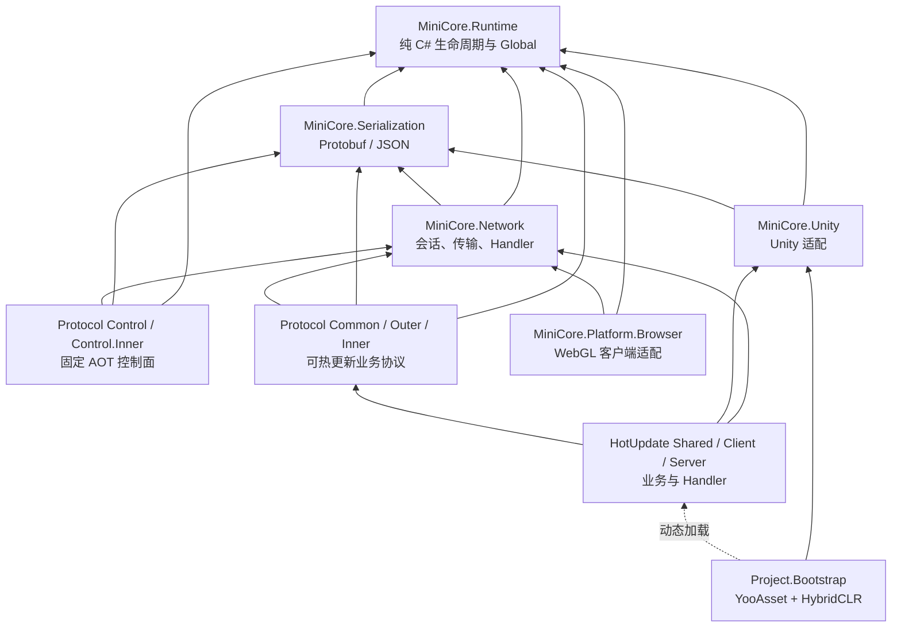
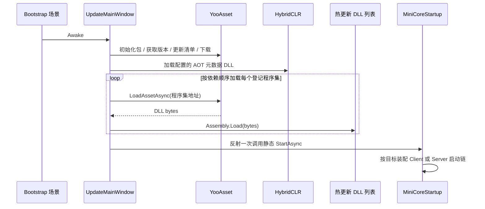

# MiniCore 架构总览

本文描述当前重构后的 MiniCore。它是项目的架构事实来源；旧目录名、`Global.Com`、`MiniCore.Model/Core`、消息对象内 Opcode、JSON 默认网络协议等说法均不再适用。

## 1. 设计目标

- 核心框架可以脱离 Unity 编译和运行；Unity 只负责适配生命周期、时间、日志、Mono/UI 组件。
- 任意业务位置可以通过静态 `Global` 获取组件，但组件必须有明确 owner 与释放时机。
- 网络能力不拆互斥 Client/Server 接口，但业务和协议按 Shared、Client、Server 物理程序集隔离，客户端不能编译或发布服务端实现。
- 业务消息使用 Protobuf；带网络角色的 Proto 消息生成稳定 Opcode，Handler 只负责第二阶段业务绑定。
- Player 不静态引用业务热更新类型。YooAsset 下载 DLL，HybridCLR 补充 AOT 元数据后，Bootstrap 反射一次启动业务入口。

## 2. 目录与程序集

| 程序集 | 路径 | 是否引用 Unity | 作用 | 可以依赖 |
| --- | --- | --- | --- | --- |
| `MiniCore.Runtime` | `Assets/Scripts/MiniCore/Runtime` | 否 | `Global`、组件基类、Timer、强类型事件、日志门面、时间接口、热更入口契约 | 无 Unity；最底层公共模型 |
| `MiniCore.Serialization` | `Assets/Scripts/MiniCore/Serialization` | 否 | `INetworkSerializer`、Parser 抽象、Protobuf 默认实现、Newtonsoft Json 对比实现 | Runtime、第三方序列化库 |
| `MiniCore.Network` | `Assets/Scripts/MiniCore/Network` | 否 | 消息角色接口、实例协议 Registry、收发、会话、RPC、心跳、Handler、TCP/UDP/KCP/WebSocket | Runtime、Serialization |
| `MiniCore.Protocol.Control/Control.Inner` | `Assets/Scripts/MiniCore/Protocol/Control` | 否 | Coordinator 查询、注册、心跳、状态和目录同步等固定控制面契约 | Runtime、Serialization、Network、Google.Protobuf |
| `MiniCore.Protocol.Common/Outer/Inner` | `Assets/Scripts/MiniCore/Protocol/Generated` | 否 | MiniBomber/NetworkLab 的共享 DTO、客户端业务消息和服务间 RPC；三个独立 HybridCLR 程序集 | Runtime、Serialization、Network、Google.Protobuf |
| `MiniCore.Unity` | `Assets/Scripts/MiniCore/Unity` | 是 | `UnityGlobalDriver`、Unity 时间/日志、输入、Mono、UI、原生文件服务与框架 ClientSettings PB | Runtime、Serialization；可使用 Unity API |
| `MiniCore.Platform.Browser` | `Assets/Scripts/MiniCore/Platform/Browser` | 是 | WebGL WebSocket 客户端适配器、IndexedDB 存储后端和 JavaScript 绑定 | Runtime、Network；只进入 WebGL Player |
| `MiniCore.HotUpdate.Shared/Client/Server` | `Assets/Scripts/MiniCore/HotUpdate` | 是 | 共用领域、客户端流程、服务端 Role 业务/Handler 三个独立热更新程序集 | Runtime、Protocol、Serialization、Network、Unity；Server 业务入口依赖固定 `MiniCore.Server` |
| `Project.Bootstrap` | `Assets/Scripts/Project/Bootstrap` | 是 | 场景启动、YooAsset、HybridCLR、DLL 加载、调用统一 HotUpdate Entry | Runtime、Unity、YooAsset、HybridCLR；不可静态引用 HotUpdate |
| `MiniCore.Editor` | `Assets/Scripts/MiniCore/Editor` | Editor | Proto、Opcode、HybridCLR、构建校验与工具窗口 | 运行时程序集与 UnityEditor |

依赖方向只能从上向下，不能反向：`Runtime <- Serialization <- Network <- Protocol <- HotUpdate`。`MiniCore.Unity` 是适配层，不应成为 Runtime/Serialization/Network/Protocol 的依赖。



## 3. Global 组件运行时

`Global` 位于 `MiniCore.Runtime`，是全局组件容器的静态门面；内部由 `GlobalRuntime` 管理组件实例、owner 引用计数、Tick 快照与线程校验。业务无需持有 App 或 Context 对象。

### 生命周期规则

| API | 适用场景 | 释放方式 |
| --- | --- | --- |
| `Global.Initialize(provider)` | 显式初始化；首次调用其他 API 时也会以系统时间自动初始化 | `Global.Shutdown()` |
| `Global.Get<T>(owner)` | 只取已存在组件，并增加 owner 引用 | `Global.Remove<T>(owner)` |
| `Global.GetOrAdd<T>(owner[, args])` | 临时或业务组件；首次创建时执行 `Awake` | `Global.Remove<T>(owner)` 或 `ReleaseAll(owner)` |
| `Global.Pin<T>([args])` | 网络、计时器、资源等常驻基础设施 | `Global.Unpin<T>()` |
| `Global.CreateScope(name)` | 场景、战斗、临时玩法等成组生命周期 | `scope.Dispose()` 自动 `ReleaseAll(scope)` |
| `Global.CreateGroup(name, businessId)` | 房间、地图、对局等同类型组件多实例容器 | `group.Dispose()` 强制释放该 Group 的全部组件 |
| `Global.GetService<T>(owner)` | 获取启动配置选中的 AppService 接口 | `ReleaseAll(owner)` 归还引用 |
| `Global.GetOrAddModule<T>([key], owner)` | 获取按需创建的 AppModule 接口 | `ReleaseAll(owner)` 归还引用 |
| `Global.Tick()` | 驱动活动组件的 `MonoUpdate` | 由宿主每帧调用 |
| `Global.ForceRemove<T>()` | 退出、切服等最高层中断 | 不用于普通业务 |

同一 owner 每获取一次就对应持有一份引用。组件在最后一份 owner 引用释放时执行 `Dispose` 并从容器移除。`Pin` 使用 Global 内部 root owner，重复 Pin 不会叠加常驻引用。

`AComponent.Dispose()` 是不可重写的两阶段入口：先标记释放、停止 Tick，并调用 `protected OnDisposing()`；这个同步钩子用于立即关闭 Socket、监听器和外部 I/O。随后取消组件任务域，等子组件和异步 `finally` 全部退场后才调用 `protected OnDispose()` 做最终清理，最后由基类自动归还该组件持有的 Global 引用。派生类不应再手写 `Global.ReleaseAll(this)`。释放期间 Global 保留同类型墓碑，既不返回旧对象，也不创建替代实例。

```csharp
public sealed class BattleFlow : IDisposable
{
    private readonly GlobalScope scope = Global.CreateScope("Battle");

    public void Start()
    {
        TimerService timer = scope.GetOrAdd<TimerService>();
    }

    public void Dispose()
    {
        scope.Dispose();
    }
}
```

不要将 `Global` 再包装为 `Global.Com`；不要把 `ForceRemove` 当成普通释放；不要遗漏 owner 释放。

### 服务、模块与玩法组件

`Global` 仍是唯一宿主，不引入 .NET 风格的容器链。新增分类只是在边界处约束“谁可以替换、谁可以多实例”：

| 分类 | 基类/标记 | 创建方式 | 外部访问 |
|---|---|---|---|
| AppService | `AAppService` + `[AppService]` | 启动配置为每个接口选择一个启用的 Provider，生成代码 Pin | `Global.GetService<TInterface>(owner)` |
| AppModule | `AAppModule` + `[AppModule]` | 生成的注册表注册，业务按需创建 | `Global.GetOrAddModule<TInterface>(key, owner)` |
| 普通组件/玩法 | `AComponent`；需要目录可发现性时加 `[ComponentCatalog]` | 业务自由 `GetOrAdd`，可放入 Group | 具体类型 |

AppService 只能由接口使用；在 Editor/Development 中，通过 `Global.Get<TConcreteService>` 绕过接口会抛出诊断。Dedicated Server 仍是 Unity Player，但目标程序集和 `AppServiceRuntimeTargets` 会在装配阶段排除 UI、音频和客户端场景等 Provider；DS 必需的网络与服务发现由服务端入口自动注册，不读取客户端启动配置。

资源、配置与 UI 已完成 AOT 框架化：`IResourceService` 位于 `MiniCore.Unity`，YooAsset Provider 位于 `MiniCore.Unity.YooAsset`，`IConfigurationService` 与 `MiniCore.UI.IUIService` 位于 `MiniCore.Unity`。`IGameObjectPool` 是按需 AppModule，Pool Key 固定由 Address、组件类型和 Group 组成。重复资源门面、CSV 配置、单例式 Pool、场景 Tag/Canvas 绑定和旧 UI API 均已删除且没有兼容包装。完整规则见 [UI 框架](UIFramework.md) 和 [项目启动与服务配置](StartupModules.md#框架资源配置与-ui-能力)。

普通 `AComponent` 不属于启动配置左侧列表。若它是开发者可直接调用的能力，可用 `[ComponentCatalog("名称", Description = "具体职责")]` 将其只读展示在右侧项目能力目录；未标记类型和框架内部装配类型不会显示。

启动配置保存 AppService 的启用状态和 Args 覆盖值。存储业务只使用 `IStorageBackend` 的逻辑键/字节 API：原生环境由 `StoragePathService` 提供文件根目录，浏览器由平台包注册 IndexedDB 后端。`ISaveService` 保存 Protobuf 等二进制数据；默认 `EncryptedSaveService` 按槽位派生独立 AES/HMAC 密钥，使用 AES-CBC 加密并以 HMAC-SHA256 防篡改。配置中的口令适合提高本地修改成本，不能作为对抗逆向或本机攻击的安全边界；修改后旧存档无法读取。具体规则见 [项目启动与服务配置](StartupModules.md#加密存档)和 [WebGL 与小游戏平台适配](WebPlatformAdaptation.md#5-存储与存档)。

`ComponentGroup` 的键是 `(组件具体类型, GroupId)`。因此两个 MOBA 对局可各自拥有 `BattleComponent`、`RoomComponent` 与计时器实例；单位、子弹、怪物等高频对象仍应由 Battle 内部实体容器或对象池管理，而不应成为 Global 多实例组件。

### MTask 结构化异步

Runtime 公开异步 API 统一使用 `MTask` / `MTask<T>`。`AComponent`、AppService、AppModule、`GlobalScope`、`ComponentGroup` 与 Unity `AMTaskBehaviour` 都是任务 Owner；开发者不需要传递 `CancellationToken`、创建 Scope 或保存启动 Handle。Owner 入口由 IL 后处理器绑定，普通类中的 MTask 调用通过当前任务节点自动加入父子树；找不到父任务或 Owner 时才挂到应用根域，并在开发环境给出诊断。

父方法退出会取消并等待未完成子任务的 `finally`；只有显式 `.Forget()` 的任务会转移到最近 Owner 监督域。普通 MTask 只能消费一次，需要多方等待时显式 `.Share()`。`MTaskExecutors.Unity`、模块自行持有的 `MTaskExecutors.CreateSingleThread(name)` 与 `MTaskExecutors.ThreadPool` 可通过 `MTask.SwitchTo` 切换；切换只投递到既有执行器，不会按调用次数创建线程。无线程平台继续使用同一 MTask API，显式线程请求会失败，支持降级的模块使用 `TryCreateSingleThread` / `TryGetThreadPool` 后切换到主循环执行器。BCL 确实要求 Token 时，只在外部适配边界使用 `MTaskExternal.GetCancellationToken()`。

`MiniCore.Runtime` 的 MTask 核心是纯 C#，不直接依赖 UniTask、Burst 或 Cecil。Unity 2021.3 的 Owner 自动注入以 Editor-only 的 `MiniCore.MTask.CodeGen.dll` 随仓库交付，仅使用编辑器内置的 ILPostProcessor/Cecil API；它不进入 Player，也不要求导入项目额外安装包。完整用法、构建工具与限制见 [MTask 结构化异步](MTask.md)。

### 强类型事件频道

事件使用 `IEvent` 标记的不可变事件对象，不再使用字符串或整数作为事件名。`ISyncEvent` 只能通过 `Publish` 派发并由 `IEventHandler<T>` / `Action<T>` 同步处理；`IAsyncEvent` 只能通过 `PublishAsync` 派发并由 `IAsyncEventHandler<T>` / `Func<T, MTask>` 顺序等待。一个类型不能同时实现两种标记。

`IApplicationEventBus` 是按需取得的 AppModule，用于跨模块、低频通知；房间、对局、窗口等局部范围使用放入 `GlobalScope` 或 `ComponentGroup` 的 `ScopedEventBus`，分组销毁时会自动解除订阅并取消等待。两种频道均支持 `WaitNextAsync<TEvent>`，它只等待调用后的下一次事件，不缓存或重放历史状态。订阅会返回值类型 `EventSubscription`，调用方必须在自身释放前 `Dispose`。

事件标记、应用级与局部频道的选型、完整生命周期范例、异步派发和编辑器诊断见 [强类型事件中心](Eventing.md)。

### Unity 与非 Unity 宿主

- Unity：`UnityGlobalDriver` 的 `Awake` 初始化 Unity 执行器、应用根任务域和 `Global`，`Update` 抽取 MTask 主线程队列后调用 `Global.Tick()`。应用退出或停止 Play Mode 时先进入 MTask 快速退出：取消任务、只抽取一次主线程队列且不等待专用线程 Join，再关闭 Global；运行期组件释放仍保持等待 finally 的完整语义。Tick 使用内部快照复用，不创建每帧 Context。
- 非 Unity：宿主自行调用 `Global.Initialize(customTimeProvider)`，在自己的循环中调用 `Global.Tick()`，进程退出时 `Global.Shutdown()`。Runtime、Protocol、Serialization、Network 不需要 UnityEngine。

### 平台能力而非平台角色

框架不把 Dedicated Server、Android、浏览器、微信或抖音编码成互斥角色。网络保持统一 `INetworkService`：同一进程既可以监听下游连接，也可以主动连接其他服务。具体传输由 `NetworkCapabilities` 判断；普通浏览器 WebGL 当前只支持 WS/WSS 客户端，不支持 TCP/UDP/KCP 和监听器。

平台 SDK 放入独立可选程序集并通过后端注册表接入，宏只停留在 asmdef、平台启动器和原生绑定处。当前普通浏览器实现及未来微信/抖音平台包的边界、网关与存储规则见 [WebGL 与小游戏平台适配](WebPlatformAdaptation.md)。

## 4. 启动与热更新链

启动场景中的 `UpdateMainWindow` 是稳定 Bootstrap。它不直接引用 `MiniCore.HotUpdate` 中的具体业务类型。



客户端 Bootstrap 调用 `MiniCore.HotUpdate.MiniCoreStartup.StartAsync()`；Dedicated Server Bootstrap 调用 `MiniCore.HotUpdate.Server.MiniCoreServerStartup.StartAsync()`。两者由目标程序集登记选择，不再在同一个 `GameStartup` 中用 BatchMode 分支。

DS Role、监听、公布地址与 Coordinator 内网地址来自包内 `StreamingAssets/MiniCoreServerRuntime.json`；源文件固定在项目根目录 `Server/DedicatedServer/Config`。完整规则见[多 Role 与独立 .NET 服务架构](DedicatedServerArchitecture.md)。

### AppService、GameStartup 与生成代码

通过 `MiniCore > 项目启动配置` 按 AppService 接口分组单选 Provider，并填写非敏感 Args 参数。多接口实现会整体同步选择，具体实现的 Args 在切换后仍独立保留。生成器为每个服务接口生成 `Global.RegisterAppService<TInterface, TImplementation>`，先完成 `RequiresServices` 依赖排序；仅 Provider 实现 `MiniCore.Service.IAsyncAppService` 时才生成并等待 `InitializeAsync()`。生成入口统一返回 `MTask`，避免 System Task 进入业务公开 API。

右侧只读能力目录按 Service、AppModule 和带 `ComponentCatalogAttribute` 的普通 `AComponent` 分组，可折叠显示描述、接口和完整命名空间。`Description` 是 `AppServiceAttribute`、`AppModuleAttribute`、`ComponentCatalogAttribute` 与 `MiniCoreStartupModuleAttribute` 的统一元数据；它不参与启动逻辑。

客户端已选服务完成初始化后，生成代码调用 `GameStartup.StartAsync()`。Dedicated Server 不调用这个客户端业务入口；热更新 `MiniCoreServerStartup` 把业务实现交给 AOT `DedicatedServerHost`，由宿主装配必需服务和注册发现，再创建按 Role 运行的业务组件。`MiniCoreStartupModule` 只保留给已有项目的传统常驻组件流程；新系统级能力应优先使用 AppService。完整接入步骤、服务列表和 HTTP/密钥约束见 [项目启动与服务配置](StartupModules.md)。

### HybridCLR 与 YooAsset

- 客户端固定携带 AOT Control，并加载业务 Common/Outer/Shared/Client 热更新 DLL；Dedicated Server 额外固定携带 Control.Inner，并加载业务 Common/Outer/Inner/Shared/Server 热更新 DLL。两侧分别拥有唯一热更新启动入口。
- AOT 程序集禁止反向引用 HybridCLR 热更新程序集；固定 `MiniCore.Server` 因此只引用 Control/Control.Inner。控制面变化必须发布新 Player，兼容的业务协议变化可随业务热更包发布。
- AOT 补充元数据由 `HybridClrAotMetadata.Generated.cs` 中的地址表决定；只保留热更代码真实触发的泛型/反射/AOT 泛型调用所需 DLL。
- 先加载 AOT 元数据，再按 asmdef 依赖顺序加载全部热更新 DLL，最后只调用登记的启动程序集 Entry。
- 改动 HotUpdate 业务后，要重新构建 DLL 并更新 YooAsset 包；仅改 C# 源码不会让已发布 Player 获得更新。

## 5. 协议、Handler 与 Opcode

详细步骤见 [网络与协议](NetworkLayerAnalysis.md)。这里记录边界：

- `.proto` 位于仓库根目录 `Proto/`，先分 `Control` 与 `Business`，再按 `Common`、`Outer`、`Inner` 通信边界组织；同一 RPC 的 Request/Response 必须位于同一文件。
- 需要进入网络层的业务消息在 Proto 中标记 `//[INormalMessage]`、`//[IRpcRequest]`、`//[IRpcResponse]`；纯配置/存档 Protobuf 不加网络角色注解。
- `IRpcResponse` 必须定义 `code = 1`、`msg = 2`。`RpcId` 不写入 Proto Body，而在 12 字节网络包头中传输，反序列化后写到生成 partial 的运行时属性。
- `Project/MiniCore/Protocol` 只配置业务生成根目录；生成器把 Control 写入固定 AOT 目录，把 Business 写入配置根的 `Common`、`Outer`、`Inner` 子目录。`MiniCore > Protocol > Generate All` 使用仓库内置 `Proto/Tools/protoc-29.5`。
- `Proto/Internal/ClientSettings.proto` 固定输出到 `MiniCore.Unity`；MiniBomber 等项目存档 PB 跟随项目协议输出目录，但没有网络角色时不会获得 Opcode。
- 客户端 Handler 位于 Client 程序集；服务端 Handler 位于 Server 程序集并使用 `[ServerHandler(DedicatedServerRole.X)]`。两者都继承 `AMHandler<TMessage>` 或 `ARpcHandler<TRequest, TResponse>`。
- Proto 生成阶段根据网络角色维护 `OpcodeManifest.json`；脚本编译后的 Editor 只扫描全部已登记热更新程序集并写入 `HotUpdateHandlerRegistration.Generated.cs`。
- 每个 `NetworkService` 启动时创建临时 Builder，先灌入消息、Opcode、角色和 Parser，再灌入 Handler；完整校验后一次性提交不可变实例 Registry。
- 有网络角色的消息即拥有稳定 Opcode；无 Handler 的合法出站消息也可发送。普通 DTO 和存档 PB 不进入网络 Registry。
- 删除协议的号码保留在 Manifest，不能人工重用或重排。

自动生成时使用直接 `new Handler()` 注册，运行时不扫描 AppDomain、不按字符串找 Handler、不用 `Activator.CreateInstance` 构造 Handler。为避免删除或改名 Handler 时旧生成表阻断首轮编译，Editor 会先生成安全空表，随后在编译成功后生成正确的直接注册表。

## 6. 编码与目录规则

### 放置规则

| 内容 | 放置位置 |
| --- | --- |
| 纯组件、事件、计时、日志、时间抽象 | `Runtime/Core`、`Runtime/Model`、`Runtime/Time`；事件按 Bus、Interface、Channel、Subscription 归档 |
| MTask | `Runtime/Threading` 下按 Core、Source、Execution、Ownership、Sharing、Cancellation、Diagnostics 归档；命名空间保持 `MiniCore.Threading` |
| 消息角色接口、实例协议 Registry | `Network/Protocol` |
| 项目 PB、角色 partial、无状态协议注册 | Project Settings 配置的已登记热更新程序集目录；默认 `Protocol/Generated` |
| 通用序列化器 | `Serialization/Interface`、`Serialization/Protobuf`、`Serialization/NewtonsoftJson` |
| 网络会话、收发、Handler 基类、TCP/UDP/KCP/WebSocket 传输 | `Network/Core`、`Network/Handler`、`Network/Transport` |
| 普通浏览器 WebGL 平台后端 | `Platform/Browser`、`Plugins/MiniCore/Browser` |
| Unity 生命周期、输入、UI Runtime、配置、对象池与平台服务 | `Unity/Driver`、`Unity/Mono`、`Unity/UI`、`Unity/Pooling`、`Unity/Serialization`、`Unity/Service` |
| YooAsset 资源与场景 Provider | `Unity/YooAsset` |
| Dedicated Server 固定宿主与控制面 | `Server` |
| HotUpdate 客户端入口与业务生成代码 | `HotUpdate/Entry`、`HotUpdate/UI/Generated`、`HotUpdate/Generated` |
| MiniBomber 业务 | `HotUpdate/Demos/MiniBomber/Shared|Client|Server`；Editor 工具通过目录内 asmref 归入 Editor |
| NetworkLab 业务 | `HotUpdate/Demos/NetworkLab/Shared|Client|Server` |
| Development Runner | `Development/Network`，只进入 Editor 或 Development Build |
| Bootstrap 与生成的 AOT 地址表 | `Project/Bootstrap` |
| Unity Editor 生成器、构建校验和性能工具 | `MiniCore/Editor` |

不要为了方便把不同职责的类堆入一个大目录；不要将 Unity API 引入 no-engine 程序集；不要让 Base 程序集静态引用 HotUpdate 类型。

### C# 规则

- 修改 C# 时遵循 `.codex/skills/csharp-performance-conventions/SKILL.md`。
- 新增或修改的方法写中文多行 XML 文档；公共 API 同样需要中文说明。
- 成员按 `UnityProperty`、`Public`、`Internal`、`Private`、`Interface`、`Override` 等 region 整理。
- 新文件 UTF-8 无 BOM；已有文件保持原编码。
- 除自动生成代码、同名泛型/partial 核心和确实紧耦合的窄例外外，一个源文件只放一个顶层类型。
- `Update`、网络收发、队列处理、循环中避免 LINQ、闭包、临时集合和无必要 `new`。
- 不回退用户已有改动；生成文件由生成器维护，业务代码不手改。

## 7. 构建前检查

构建前会执行以下校验：

1. Proto 注解、RPC `Code/Msg` 固定字段、生成的 Message/Role/Parser Registry 一致性。
2. Opcode Manifest、当前 Handler、Opcode Registry 与 HotUpdate Handler Registry 一致性。
3. HybridCLR 配置、AOT 元数据与热更新 DLL/YooAsset 资源同步。
4. 每个 AppService 接口只能选定一个启用的 Provider，且该 Provider 的依赖必须在项目启动配置中完整可用。

若校验报错，先修正源 Proto 或 Handler，等待 Unity 自动编译和同步完成，再执行构建；不要手改生成映射绕过校验。
