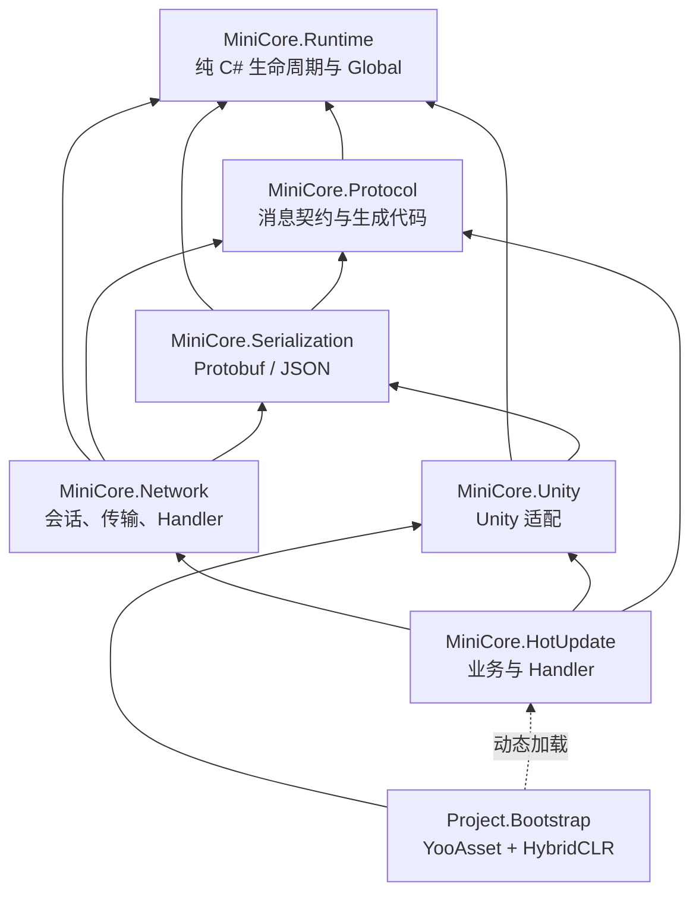
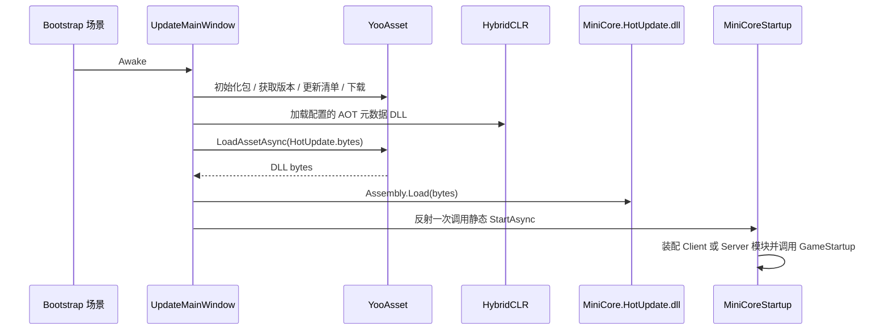

# MiniCore 架构总览

本文描述当前重构后的 MiniCore。它是项目的架构事实来源；旧目录名、`Global.Com`、`MiniCore.Model/Core`、消息对象内 Opcode、JSON 默认网络协议等说法均不再适用。

## 1. 设计目标

- 核心框架可以脱离 Unity 编译和运行；Unity 只负责适配生命周期、时间、日志、Mono/UI 组件。
- 任意业务位置可以通过静态 `Global` 获取组件，但组件必须有明确 owner 与释放时机。
- 客户端与 Dedicated Server 共用协议、网络、定时器与热更新业务程序集。
- 业务消息使用 Protobuf；网络 Opcode 由实际 Handler 绑定自动生成，并保持历史稳定。
- Player 不静态引用业务热更新类型。YooAsset 下载 DLL，HybridCLR 补充 AOT 元数据后，Bootstrap 反射一次启动业务入口。

## 2. 目录与程序集

| 程序集 | 路径 | 是否引用 Unity | 作用 | 可以依赖 |
| --- | --- | --- | --- | --- |
| `MiniCore.Runtime` | `Assets/Scripts/MiniCore/Runtime` | 否 | `Global`、组件基类、Timer、事件、日志门面、时间接口、热更入口契约 | 无 Unity；最底层公共模型 |
| `MiniCore.Serialization` | `Assets/Scripts/MiniCore/Serialization` | 否 | `INetworkSerializer`、Protobuf 默认实现、Newtonsoft Json 对比实现 | Runtime、Protocol、第三方序列化库 |
| `MiniCore.Protocol` | `Assets/Scripts/MiniCore/Protocol` | 否 | 消息角色接口、`OpcodeRegistry`、Proto 生成消息、Parser 注册表 | Runtime、Google.Protobuf |
| `MiniCore.Network` | `Assets/Scripts/MiniCore/Network` | 否 | 收发、会话、RPC、心跳、Handler 基类、TCP/UDP/KCP | Runtime、Protocol、Serialization |
| `MiniCore.Unity` | `Assets/Scripts/MiniCore/Unity` | 是 | `UnityGlobalDriver`、Unity 时间/日志、输入、Mono 与 UI 契约 | Runtime、Serialization；可使用 Unity API |
| `MiniCore.HotUpdate` | `Assets/Scripts/MiniCore/HotUpdate` | 是 | 客户端/服务端业务入口、资源/UI 业务、业务 Handler、生成 Handler 表 | Runtime、Protocol、Serialization、Network、Unity |
| `Project.Bootstrap` | `Assets/Scripts/Project/Bootstrap` | 是 | 场景启动、YooAsset、HybridCLR、DLL 加载、选择 Client/Server Entry | Runtime、Unity、YooAsset、HybridCLR；不可静态引用 HotUpdate |
| `MiniCore.Editor` | `Assets/Scripts/MiniCore/Editor` | Editor | Proto、Opcode、HybridCLR、构建校验与工具窗口 | 运行时程序集与 UnityEditor |

依赖方向只能从上向下，不能反向：`Runtime <- Protocol/Serialization <- Network <- HotUpdate`。`MiniCore.Unity` 是适配层，不应成为 Runtime/Protocol/Network 的依赖。



## 3. Global 组件运行时

`Global` 位于 `MiniCore.Runtime`，是全局组件容器的静态门面；内部由 `GlobalRuntime` 管理组件实例、owner 引用计数、Tick 快照与线程校验。业务无需持有 App 或 Context 对象。

### 生命周期规则

| API | 适用场景 | 释放方式 |
| --- | --- | --- |
| `Global.Initialize(provider)` | 显式初始化；首次调用其他 API 时也会以系统时间自动初始化 | `Global.Shutdown()` |
| `Global.Get<T>(owner)` | 只取已存在组件，并增加 owner 引用 | `Global.Remove<T>(owner)` |
| `Global.GetOrAdd<T>(owner[, args])` | 临时或业务组件；首次创建时执行 `Awake` | `Global.Remove<T>(owner)` 或 `ReleaseAll(owner)` |
| `Global.Pin<T>([args])` | 网络、计时器、资源等常驻基础设施 | `Global.Unpin<T>()` |
| `Global.CreateScope(name)` | 场景、战斗、临时玩法等成组生命周期 | `scope.Dispose()` 自动 `ReleaseAll(scope)` |
| `Global.CreateGroup(name, businessId)` | 房间、地图、对局等同类型组件多实例容器 | `group.Dispose()` 强制释放该 Group 的全部组件 |
| `Global.GetService<T>(owner)` | 获取启动配置选中的 AppService 接口 | `ReleaseAll(owner)` 归还引用 |
| `Global.GetOrAddModule<T>([key], owner)` | 获取按需创建的 AppModule 接口 | `ReleaseAll(owner)` 归还引用 |
| `Global.Tick()` | 驱动活动组件的 `MonoUpdate` | 由宿主每帧调用 |
| `Global.ForceRemove<T>()` | 退出、切服等最高层中断 | 不用于普通业务 |

同一 owner 每获取一次就对应持有一份引用。组件在最后一份 owner 引用释放时执行 `Dispose` 并从容器移除。`Pin` 使用 Global 内部 root owner，重复 Pin 不会叠加常驻引用。

```csharp
public sealed class BattleFlow : IDisposable
{
    private readonly GlobalScope scope = Global.CreateScope("Battle");

    public void Start()
    {
        TimerComponent timer = scope.GetOrAdd<TimerComponent>();
    }

    public void Dispose()
    {
        scope.Dispose();
    }
}
```

不要将 `Global` 再包装为 `Global.Com`；不要把 `ForceRemove` 当成普通释放；不要遗漏 owner 释放。

### 服务、模块与玩法组件

`Global` 仍是唯一宿主，不引入 .NET 风格的容器链。新增分类只是在边界处约束“谁可以替换、谁可以多实例”：

| 分类 | 基类/标记 | 创建方式 | 外部访问 |
|---|---|---|---|
| AppService | `AAppService` + `[AppService]` | 启动配置为每个接口在 Client/Server 选择一个 Provider，生成代码 Pin | `Global.GetService<TInterface>(owner)` |
| AppModule | `AAppModule` + `[AppModule]` | 生成的注册表注册，业务按需创建 | `Global.GetOrAddModule<TInterface>(key, owner)` |
| 普通组件/玩法 | `AComponent`；需要目录可发现性时加 `[ComponentCatalog]` | 业务自由 `GetOrAdd`，可放入 Group | 具体类型 |

AppService 只能由接口使用；在 Editor/Development 中，通过 `Global.Get<TConcreteService>` 绕过接口会抛出诊断。Dedicated Server 是 Unity Player，不存在“框架层禁止资源、Canvas 或物理加载”的规则；每个目标只校验自己所选服务、依赖与 Provider 是否完整。

资源、资产、场景绑定与 UI 已完成 AppService 化：`IResourceService` / `YooAssetResourceService`、`IAssetService` / `AssetService`、`ISceneBindingService` / `SceneBindingService`、`IUIService` / `UIService`。它们必须通过 `Global.GetService<TInterface>(owner)` 获取，旧的 `YooAssetResourceComponent`、`AssetsComponent`、`TagsComponent`、`UIFactoryComponent` 已删除且没有兼容包装。完整迁移映射和使用示例见 [项目启动与服务配置](StartupModules.md#已迁移的资源与-ui-服务)。

普通 `AComponent` 不属于启动配置左侧列表。若它是开发者可直接调用的能力，可用 `[ComponentCatalog("名称", Description = "具体职责")]` 将其只读展示在右侧项目能力目录；未标记类型和框架内部装配类型不会显示。

启动配置保存 AppService 的启用状态和 Args 覆盖值。`StoragePathService` 统一提供存档和本地运行数据的根目录；`RelativePath` 只能填写相对于产品专属 `Application.persistentDataPath` 的目录，例如 `MyGame` 或 `Company/MyGame`，代码默认值为兼容旧项目的 `MiniCore`。`EncryptedSaveService` 只依赖 `IStoragePathService`，并通过开发者填写的 `EncryptionKey` 以 SHA-256 派生主密钥、以 HMAC-SHA256 按槽位派生工作密钥。该参数会明文保存在配置资产和生成代码中，适合本地防误改，不能作为对抗逆向或本机攻击的安全边界；修改后旧存档无法读取。具体启用与替换流程见 [项目启动与服务配置](StartupModules.md#加密存档)。

`ComponentGroup` 的键是 `(组件具体类型, GroupId)`。因此两个 MOBA 对局可各自拥有 `BattleComponent`、`RoomComponent` 与计时器实例；单位、子弹、怪物等高频对象仍应由 Battle 内部实体容器或对象池管理，而不应成为 Global 多实例组件。

### Unity 与非 Unity 宿主

- Unity：`UnityGlobalDriver` 的 `Awake` 调用 `Global.Initialize(new UnityTimeProvider())`，`Update` 调用 `Global.Tick()`，退出时调用 `Global.Shutdown()`。Tick 使用内部快照复用，不创建每帧 Context。
- 非 Unity：宿主自行调用 `Global.Initialize(customTimeProvider)`，在自己的循环中调用 `Global.Tick()`，进程退出时 `Global.Shutdown()`。Runtime、Protocol、Serialization、Network 不需要 UnityEngine。

## 4. 启动与热更新链

启动场景中的 `UpdateMainWindow` 是稳定 Bootstrap。它不直接引用 `MiniCore.HotUpdate` 中的具体业务类型。



Bootstrap 在加载 DLL 后反射调用固定静态类型 `MiniCore.HotUpdate.MiniCoreStartup.StartAsync()`。该方法根据 `Application.isBatchMode` 选择 Client 或 Dedicated Server 的模块列表，随后调用 `GameStartup`。

Server 通过 `-serverPort <port>` 指定端口，缺省为 `20000`。任一步骤失败时不应启动监听。

### AppService、GameStartup 与生成代码

通过 `MiniCore > 项目启动配置` 为 AppService Provider 选择 Client、Server 或两者，并填写非敏感 Args 参数。生成器为每个服务接口生成 `Global.RegisterAppService<TInterface, TImplementation>`，先完成 `RequiresServices` 依赖排序；仅 Provider 实现 `MiniCore.Service.IAsyncAppService` 时才生成并等待 `InitializeAsync()`。同一目标没有异步服务时，生成普通 `Task` 方法，避免无意义的 `async` 与无效模式匹配。

右侧只读能力目录按 Service、AppModule 和带 `ComponentCatalogAttribute` 的普通 `AComponent` 分组，可折叠显示描述、接口和完整命名空间。`Description` 是 `AppServiceAttribute`、`AppModuleAttribute`、`ComponentCatalogAttribute` 与 `MiniCoreStartupModuleAttribute` 的统一元数据；它不参与启动逻辑。

所有已选服务完成初始化后，生成代码调用项目唯一的 `GameStartup.StartAsync()`。`MiniCoreStartupModule` 保留给已有项目的传统常驻组件流程；新系统级能力应优先使用 AppService。完整接入步骤、服务列表和 HTTP/密钥约束见 [项目启动与服务配置](StartupModules.md)。

### HybridCLR 与 YooAsset

- `MiniCore.HotUpdate.dll` 必须作为 YooAsset 资源，以固定地址 `HotUpdate`（由 Bootstrap 生成配置定义）进入包。
- AOT 补充元数据由 `HybridClrAotMetadata.Generated.cs` 中的地址表决定；只保留热更代码真实触发的泛型/反射/AOT 泛型调用所需 DLL。
- 先加载 AOT 元数据，再加载 HotUpdate DLL，最后调用 Entry。
- 改动 HotUpdate 业务后，要重新构建 DLL 并更新 YooAsset 包；仅改 C# 源码不会让已发布 Player 获得更新。

## 5. 协议、Handler 与 Opcode

详细步骤见 [网络与协议](NetworkLayerAnalysis.md)。这里记录边界：

- `.proto` 位于仓库根目录 `Proto/`，按业务域组织；不要再按 ClientToServer/ServerToClient 拆分。
- 业务消息在 Proto 中标记 `//[INormalMessage]`、`//[IRpcRequest]`、`//[IRpcResponse]`。
- `IRpcResponse` 必须定义 `code = 1`、`msg = 2`。`RpcId` 不写入 Proto Body，而在 12 字节网络包头中传输，反序列化后写到生成 partial 的运行时属性。
- `MiniCore > Protocol > Generate All` 使用仓库内置 `Proto/Tools/protoc-29.5` 生成 Message、Role 与 Parser Registry。
- Handler 在 `MiniCore.HotUpdate` 中继承 `AMHandler<TMessage>` 或 `ARpcHandler<TRequest, TResponse>`。
- 脚本编译后的 Editor 自动扫描 Handler，写入 `OpcodeManifest.json`、`OpcodeRegistry.Generated.cs` 和 `HotUpdateHandlerRegistry.Generated.cs`。
- **仅绑定了 Handler 的消息才有运行时 Opcode。** RPC Handler 的 Request 和 Response 均会登记；未绑定消息不会被网络层发送。
- 删除协议的号码保留在 Manifest，不能人工重用或重排。

自动生成时使用直接 `new Handler()` 注册，运行时不扫描 AppDomain、不按字符串找 Handler、不用 `Activator.CreateInstance` 构造 Handler。为避免删除或改名 Handler 时旧生成表阻断首轮编译，Editor 会先生成安全空表，随后在编译成功后生成正确的直接注册表。

## 6. 编码与目录规则

### 放置规则

| 内容 | 放置位置 |
| --- | --- |
| 纯组件、事件、计时、日志、时间抽象 | `Runtime/Core`、`Runtime/Model`、`Runtime/Time` |
| 消息角色、Opcode、Protobuf 生成物 | `Protocol/Model`、`Protocol/Generated` |
| 通用序列化器 | `Serialization/Interface`、`Serialization/Protobuf`、`Serialization/NewtonsoftJson` |
| 网络会话、收发、Handler 基类、传输实现 | `Network/Core`、`Network/Handler`、`Network/Transport` |
| Unity 生命周期、输入、UI 契约、Unity serializer、平台服务 | `Unity/Driver`、`Unity/Mono`、`Unity/UI`、`Unity/Serialization`、`Unity/Service` |
| 热更新资源、资产、场景绑定和 UI 服务 | `HotUpdate/Service` |
| 客户端对象池与其他业务 | `HotUpdate/Client` |
| Client/Server 热更新启动入口 | `HotUpdate/Entry` |
| 业务网络 Handler | `HotUpdate/Network/Handler` |
| Bootstrap 与生成的 AOT 地址表 | `Project/Bootstrap` |
| Unity Editor 生成器、构建校验和性能工具 | `MiniCore/Editor` |

不要为了方便把不同职责的类堆入一个大目录；不要将 Unity API 引入 no-engine 程序集；不要让 Base 程序集静态引用 HotUpdate 类型。

### C# 规则

- 修改 C# 时遵循 `.codex/skills/csharp-performance-conventions/SKILL.md`。
- 新增或修改的方法写中文多行 XML 文档；公共 API 同样需要中文说明。
- 成员按 `UnityProperty`、`Public`、`Internal`、`Private`、`Interface`、`Override` 等 region 整理。
- 新文件 UTF-8 无 BOM；已有文件保持原编码。
- `Update`、网络收发、队列处理、循环中避免 LINQ、闭包、临时集合和无必要 `new`。
- 不回退用户已有改动；生成文件由生成器维护，业务代码不手改。

## 7. 构建前检查

构建前会执行以下校验：

1. Proto 注解、RPC `Code/Msg` 固定字段、生成的 Message/Role/Parser Registry 一致性。
2. Opcode Manifest、当前 Handler、Opcode Registry 与 HotUpdate Handler Registry 一致性。
3. HybridCLR 配置、AOT 元数据与热更新 DLL/YooAsset 资源同步。
4. 每个 Client/Server 目标的 AppService 接口只能选定一个 Provider，且该 Provider 的依赖必须在同一目标完整可用。

若校验报错，先修正源 Proto 或 Handler，等待 Unity 自动编译和同步完成，再执行构建；不要手改生成映射绕过校验。
