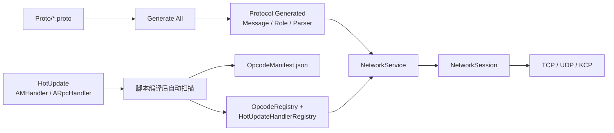

# MiniCore 网络与协议

本文描述重构后当前实现。全局程序集边界与启动流程见 [架构总览](Architecture.md)，快速规则见 [AI 项目上下文](AI_CONTEXT.md)。

## 1. 网络层组成

| 层级 | 路径 | 职责 |
| --- | --- | --- |
| 协议契约与生成物 | `MiniCore.Protocol` | `INetworkMessage`、`INormalMessage`、`IRpcRequest`、`IRpcResponse`、Opcode、Protobuf Parser Registry |
| 序列化 | `MiniCore.Serialization` | `INetworkSerializer`、`ProtobufSerializer`、JSON 迁移/性能实现 |
| 网络运行时 | `MiniCore.Network` | `NetworkService`、Session、RPC、心跳、Handler 基类、TCP/UDP/KCP |
| 业务层 | `MiniCore.HotUpdate` | 业务 Proto 对应的 Handler 与自动生成的直接注册表 |
| 编辑器生成 | `MiniCore.Editor` | Proto 生成、Handler 扫描、Opcode Manifest、构建校验 |



## 2. Proto 与生成流程

### 2.1 文件位置与标记

业务 `.proto` 放在仓库根目录 `Proto/`，可按登录、背包、战斗等领域创建子目录。不要按消息方向拆目录；同一个 RPC 的 Request/Response 应放在同一业务 Proto 文件中。

```proto
syntax = "proto3";

package game.battle;
option csharp_namespace = "MiniCore.Protocol.Generated";

//[IRpcRequest]
message EnterBattleRequest {
  int64 role_id = 1;
}

//[IRpcResponse]
message EnterBattleResponse {
  int32 code = 1;
  string msg = 2;
  int64 battle_id = 3;
}
```

| 标记 | 生成的接口 | 含义 |
| --- | --- | --- |
| `//[INormalMessage]` | `INormalMessage` | 单向普通消息 |
| `//[IRpcRequest]` | `IRpcRequest` | 需要框架级响应匹配的请求 |
| `//[IRpcResponse]` | `IRpcResponse` | RPC 响应；必须有 `code` 与 `msg` 固定字段 |

`RpcId` 不是 Proto 字段。它在网络包头中传输，反序列化后写入生成 partial 的运行时属性；因此不会污染跨语言的 Protobuf Body。

### 2.2 执行生成

修改 Proto 后在 Unity 执行：

```text
MiniCore > Protocol > Generate All
```

此命令自动选择 `Proto/Tools/protoc-29.5` 中与当前平台匹配的官方 protoc，版本锁定为 `29.5`。它生成：

| 输出 | 路径 | 用途 |
| --- | --- | --- |
| Protobuf C# 消息 | `Protocol/Generated/Message` | Google.Protobuf 的消息类 |
| 消息角色 partial | `Protocol/Generated/Role` | 为消息实现网络角色接口，提供运行时 `RpcId` 属性 |
| Parser 注册表 | `Protocol/Generated/Registry` | `ProtobufMessageRegistry` 按运行时类型反序列化 |

`Proto/Tools` 下的 Google 标准 `.proto` 仅用于 import，不参与业务消息扫描。当前生成目录为扁平输出，因此业务 Proto 文件名必须全局唯一。

## 3. Handler 驱动的 Opcode

### 3.1 为什么 Opcode 不按全部 Proto 消息生成

Opcode 表示一条消息已经接入当前网络处理链，而不是单纯存在一个数据类。MiniCore 的规则是：**只有被已编译的 HotUpdate Handler 绑定的消息才拥有运行时 Opcode。**

```csharp
public sealed class EnterBattleHandler
    : ARpcHandler<EnterBattleRequest, EnterBattleResponse>
{
    public override UniTask HandleAsync(
        NetworkSession session,
        EnterBattleRequest request,
        EnterBattleResponse response)
    {
        response.Code = 0;
        response.Msg = string.Empty;
        return UniTask.CompletedTask;
    }
}
```

- `AMHandler<TMessage>` 为普通消息 `TMessage` 绑定一个普通 Opcode。
- `ARpcHandler<TRequest, TResponse>` 为 Request 和 Response 都登记 RPC Opcode；Request Opcode 绑定处理器，Response Opcode 用于响应解码和 RPC 匹配。
- 只有标记了消息角色还不够。没有对应 Handler 的消息不会写入运行时 `MessageToOpcode`，也不能调用网络发送 API。
- 一个 Request/普通消息只能有一个 Handler；重复绑定会在自动生成/构建校验阶段失败。

### 3.2 自动同步时机

无需 Opcode 菜单。HotUpdate C# 源码变更并完成脚本编译后：

1. `OpcodeHandlerRegistryInvalidator` 先将旧的直接 Handler 注册表变为安全空表，避免删除/改名 Handler 时旧 `new Handler()` 引用阻断首轮编译。
2. 域重载后 `OpcodeAutoGenerator` 扫描已编译 `MiniCore.HotUpdate`。
3. `OpcodeRegistryGenerator` 更新稳定清单、Protocol Opcode 映射与 HotUpdate 直接 Handler 注册表。
4. 若生成文件发生改变，Unity 再编译一轮；最终运行时注册表使用直接构造，无反射扫描。

生成物与约束：

| 文件 | 规则 |
| --- | --- |
| `Proto/Manifest/OpcodeManifest.json` | 稳定号码唯一事实来源；删除项永久保留，禁止手改/复用 |
| `Protocol/Generated/Registry/OpcodeRegistry.Generated.cs` | Type -> Opcode、Opcode -> Handler 元数据 |
| `HotUpdate/Generated/Network/HotUpdateHandlerRegistry.Generated.cs` | 直接 `new` 每个已绑定 Handler；运行时不扫描 AppDomain |

普通消息从 `100001` 起，RPC 从 `200001` 起。编号稳定性来自 Manifest，而不是类型排序。

## 4. 网络包与编解码

网络业务包固定为 12 字节头加 Protobuf Body：

```text
0               4               12
+---------------+---------------+--------------------+
| opcode uint32 | rpcId int64   | protobuf payload   |
| big-endian    | big-endian    | variable length    |
+---------------+---------------+--------------------+
```

| 字段 | 说明 |
| --- | --- |
| `opcode` | 从 `OpcodeRegistry` 按消息 `Type` 查询，不保存在消息对象中 |
| `rpcId` | 普通消息为 `0`；RPC 请求与响应用于关联 pending RPC |
| `payload` | `ProtobufSerializer` 产生的 Protobuf 字节；包头字段不重复写入 Body |

传输层承载规则：

| Transport | 业务包承载方式 |
| --- | --- |
| TCP | `length int32 big-endian + packet`，由 `LengthPrefixedTcpTransportBase` 处理粘包/半包 |
| UDP | 一个 datagram 对应一个业务 packet |
| KCP | UDP 承载 KCP 分片，KCP 重组后向上交付完整业务 packet |

`NetworkService` 缓存 Type 到 Opcode 的结果、使用入站并发队列接收数据，并在主线程 Tick 中完成反序列化和业务 Handler 派发。网络线程不调用 Unity API，也不直接执行业务 Handler。

## 5. 调用方式

### 客户端连接与发送

`NetworkService` 是业务网络入口，由启动配置生成的 `Global.RegisterAppService<INetworkService, NetworkService>` 注册，并由生成代码调用 `HotUpdateHandlerRegistry.Register(network)` 注册 Handler。业务侧通过接口获取：

```csharp
INetworkService network = Global.GetService<INetworkService>(this);

bool connected = await network.ConnectDefaultTcpSessionAsync("127.0.0.1", 20000);
if (!connected)
{
    return;
}

await network.SendAsync(new SomeNormalMessage());
EnterBattleResponse response = await network.CallAsync<EnterBattleRequest, EnterBattleResponse>(
    new EnterBattleRequest { RoleId = 10001 });
```

发包前必须存在对应 Opcode；若消息没有 Handler 绑定，修复 Handler，而不是手工给消息硬编码 Opcode。

### 服务端

`GameStartup` 在 Dedicated Server batch mode 下执行：

```text
Global.RegisterAppService<INetworkService, NetworkService>()
    -> HotUpdateHandlerRegistry.Register(network)
    -> Global.Pin<TimerComponent>()
    -> network.StartKcpServerAsync("0.0.0.0", port)
```

端口读取 `-serverPort <port>`，缺省 `20000`。所有客户端/服务器业务 Handler 可以放在同一个 HotUpdate 程序集；业务内按运行环境或会话角色区分处理逻辑。

## 6. 验证清单

修改网络相关代码后检查：

1. Proto 修改后已执行 `Generate All`，生成文件未缺失。
2. Unity 已完成脚本编译与 Opcode 自动同步，Console 无 C# 错误。
3. 新消息有对应 Handler；删除消息或 Handler 后没有手动复用旧 Opcode。
4. RPC Response 保留 `Code`、`Msg` 字段，且 `RpcId` 没有加入 Proto Body。
5. Protobuf、完整入站包、RPC 相关性能测试仍可从 `Assets/Tests/Editor` 执行。
6. 构建前校验通过；HotUpdate DLL 与所需 AOT 元数据均已进入 YooAsset 包。
