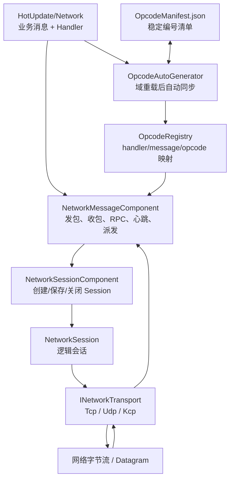
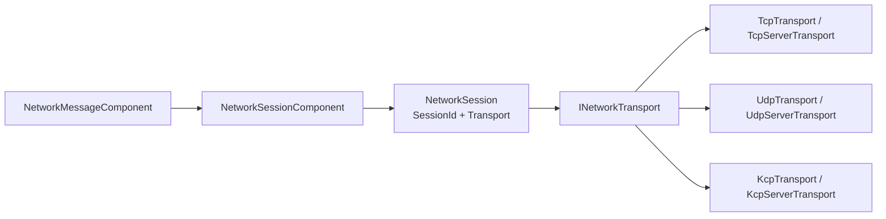
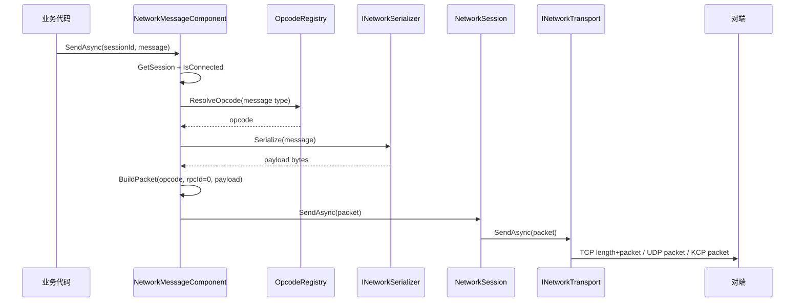
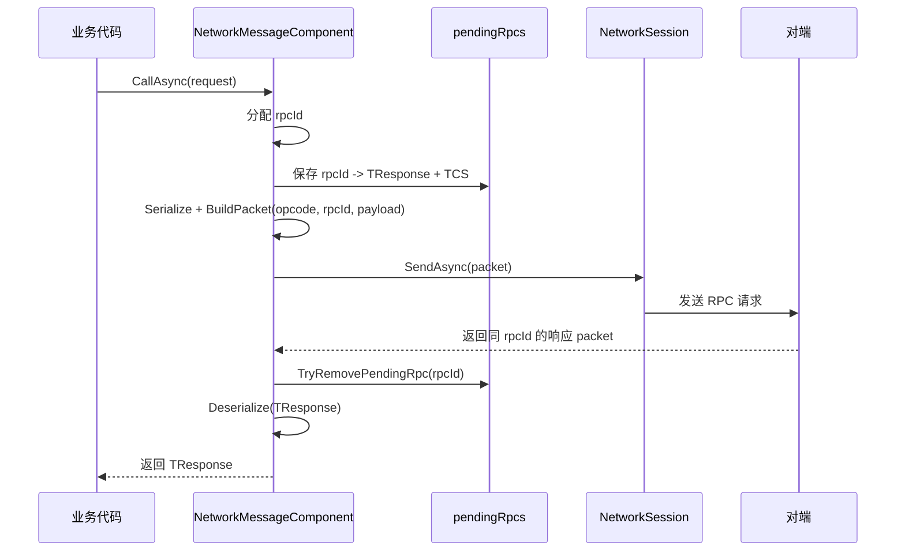
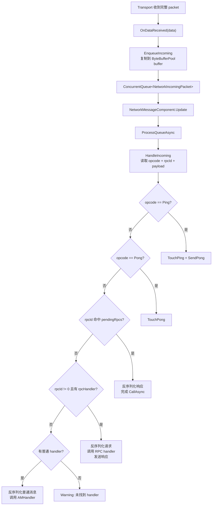
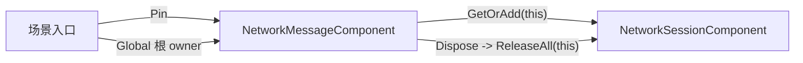

# MiniCore 网络层解析

本文基于当前项目代码整理 MiniCore 网络框架的结构、数据格式、消息分类、收发链路、生命周期和扩展方式。本文描述的是当前实现；后续性能改造计划见 [优化路线图](OptimizationRoadmap.md)。

## 目录

- [整体分层](#整体分层)
- [核心数据结构](#核心数据结构)
- [Opcode 自动绑定与构建校验](#opcode-自动绑定与构建校验)
- [协议包格式](#协议包格式)
- [发送流程](#发送流程)
- [接收与派发流程](#接收与派发流程)
- [连接与会话管理](#连接与会话管理)
- [网络组件生命周期](#网络组件生命周期)
- [TCP / UDP / KCP 传输差异](#tcp--udp--kcp-传输差异)
- [心跳与探测](#心跳与探测)
- [如何新增协议](#如何新增协议)
- [关键入口速查](#关键入口速查)
- [注意事项](#注意事项)

## 整体分层

MiniCore 网络层主要分成三层：

| 层级 | 路径 | 职责 |
| --- | --- | --- |
| 基础模型与传输层 | `Assets/Scripts/MiniCore/Model/Network` | 定义协议接口、序列化接口、handler 基类、opcode 注册表、TCP/UDP/KCP transport、server/session 基础实现。 |
| 核心组件层 | `Assets/Scripts/MiniCore/Core/Component/Network` | 管理客户端/服务端 session，封装连接、发包、RPC、心跳、收包队列和 handler 派发。 |
| 热更新业务层 | `Assets/Scripts/MiniCore/HotUpdate/Network` | 定义实际业务消息实体和业务 handler，例如 `DemoNormalMessage`、`DemoRpcRequest`、`DemoRpcHandler`。 |

整体关系如下：



## 核心数据结构

### 协议消息类型

所有业务协议都实现 `IProtocol`：

```csharp
public interface IProtocol
{
    uint Opcode { get; }
}
```

当前框架按接口把消息分成三类：

| 类型 | 接口 | 用途 | 示例 |
| --- | --- | --- | --- |
| 普通消息 | `IProtocol` | 单向通知或无需框架级响应的消息。 | `DemoNormalMessage`、`DisconnectNotice` |
| RPC 请求 | `IRequest : IProtocol` | 需要等待响应的请求，带 `RpcId`。 | `DemoRpcRequest` |
| RPC 响应 | `IResponse : IProtocol` | RPC 返回值，带 `RpcId`、`ErrorCode`、`Message`。 | `DemoRpcResponse` |

业务消息类通常放在 `Assets/Scripts/MiniCore/HotUpdate/Network/Entity`。示例消息里的 `Opcode => 0` 是兜底值，实际运行时优先使用 `OpcodeRegistry` 生成映射。

### Handler 类型

业务处理器位于 `Assets/Scripts/MiniCore/HotUpdate/Network/Handler`，分为普通消息 handler 和 RPC handler。

| Handler 基类 | 泛型参数 | 方法签名 | 用途 |
| --- | --- | --- | --- |
| `AMHandler<TMessage>` | 普通消息类型 | `HandleAsync(NetworkSession session, TMessage message)` | 处理 `IProtocol` 普通消息。 |
| `ARpcHandler<TRequest, TResponse>` | 请求/响应类型 | `HandleAsync(NetworkSession session, TRequest request, TResponse response)` | 处理 RPC 请求，并填充响应对象。 |

`NetworkMessageComponent.AutoRegisterHandlersFromAssembly("HotUpdate")` 在 `Awake` 阶段反射扫描 HotUpdate 程序集，创建每个 Handler 的单例并注册到内部字典：

- `handlers`：`opcode -> { MessageType, INetworkMessageHandlerInvoker }`，用于普通消息派发。
- `rpcHandlers`：`opcode -> { RequestType, ResponseType, INetworkRpcHandlerInvoker, ResponseFactory }`，用于 RPC 请求派发。

反射仅发生在启动注册阶段。`AMHandler<TMessage>` 实现 `INetworkMessageHandlerInvoker`，`ARpcHandler<TRequest,TResponse>` 实现 `INetworkRpcHandlerInvoker`；收包时通过缓存接口直接调用，**不会使用 `MethodInfo.Invoke`，也不会为派发创建 `object[]` 参数数组**。RPC 响应通过启动阶段缓存的 `ResponseFactory` 创建，不再在每次请求时调用 `Activator.CreateInstance`。

### Opcode 注册结构

`OpcodeRegistry` 是中心映射表，实际映射由生成文件 `Assets/Scripts/MiniCore/Model/Generated/OpcodeRegistry.Generated.cs` 填充。

主要映射包括：

| 映射 | 作用 |
| --- | --- |
| `HandlerToOpcode` | handler 类型全名 -> opcode。自动注册 handler 时使用。 |
| `OpcodeToHandler` | opcode -> handler 类型、请求类型、响应类型、是否 RPC。收包派发时使用。 |
| `MessageToOpcode` | 消息类型全名 -> opcode。发包时解析消息 opcode。 |

### Opcode 自动绑定与构建校验

`OpcodeManifest.json` 是协议编号的唯一事实来源，按协议类型全名保存稳定编号。首次发现协议时分配编号；后续新增只追加，已删除类型保留历史占位，避免排序、插入类型或删除类型导致旧编号重排。

自动流程如下：

1. HotUpdate 程序集重新编译并发生 Unity 域重载。
2. `OpcodeAutoGenerator` 在 `EditorApplication.delayCall` 中调用 `OpcodeRegistryGenerator.Synchronize`。
3. 生成器扫描协议和 Handler，更新 `OpcodeManifest.json` 与 `OpcodeRegistry.Generated.cs`；内容未变化时不写文件，避免无限编译。
4. 构建前 `OpcodeBuildValidator` 验证清单、当前协议和生成文件的一致性；校验失败会终止构建。

菜单仍保留为人工修复与校验入口，不是日常新增协议的必要步骤：

```text
MiniCore/Opcode/Generate (HotUpdate)
```

默认 opcode 分段：

| 分段 | 起始值 | 来源 |
| --- | --- | --- |
| 普通消息 | `100001` | `AMHandler<TMessage>` |
| RPC 消息 | `200001` | `ARpcHandler<TRequest,TResponse>` |
| 孤立协议 | RPC 段之后 | 实现了 `IProtocol` 但没有 handler 的类型 |

RPC 生成时，请求和响应都会分配 opcode；请求 opcode 绑定 RPC handler，响应 opcode 主要用于类型映射和日志。

### Session 与 Transport

`NetworkSession` 是框架向上暴露的逻辑会话，内部包装一个 `INetworkTransport`。



`INetworkTransport` 统一了底层传输能力：

- `ConnectAsync(host, port)`：客户端连接。
- `SendAsync(ArraySegment<byte>)`：发送已经构造好的业务 packet。
- `Disconnect()` / `Dispose()`：断开和释放。
- `OnDataReceived`：底层收到完整业务 packet 后触发。
- `OnDisconnected`：连接断开事件。

服务端 transport 不支持 `ConnectAsync`，它们通过 server session 包装已有连接或远端端点。

## 协议包格式

MiniCore 使用两层包格式：业务层 packet 和传输层 framing。

### 业务层 Packet

`NetworkMessageComponent.BuildPacket` 构造业务层 packet：

```text
0               4               12
+---------------+---------------+--------------------+
| opcode uint32 | rpcId int64   | payload bytes      |
| big-endian    | big-endian    | serializer output  |
+---------------+---------------+--------------------+
```

字段说明：

| 字段 | 长度 | 说明 |
| --- | --- | --- |
| `opcode` | 4 bytes | 消息编号，大端序，来自 `OpcodeRegistry` 或消息自身 fallback。 |
| `rpcId` | 8 bytes | 普通消息为 `0`；RPC 请求/响应为非 0。 |
| `payload` | 可变 | 序列化后的消息体，默认 JSON bytes。心跳包没有 payload。 |

字节序工具由 `NetBinaryCodec` 提供，读写均为 big-endian。

### 传输层 Framing

不同 transport 对业务层 packet 的承载方式不同：

| 传输 | Framing |
| --- | --- |
| TCP | 额外加 `length int32 big-endian` 前缀，格式为 `length + packet`。 |
| UDP | 一个 UDP datagram 就是一个完整业务 packet。 |
| KCP | 底层用 UDP 承载 KCP segment，KCP 重组后向上交付完整业务 packet。 |

TCP 的长度前缀由 `LengthPrefixedTcpTransportBase` 处理，因此 `NetworkMessageComponent` 不需要关心粘包/半包。

## 发送流程

### 普通消息

入口：

```csharp
NetworkMessageComponent.SendAsync<TMessage>(sessionId, message)
```

流程：



关键点：

- 普通消息 `rpcId` 固定为 `0`。
- 如果 session 不存在或未连接，当前实现只打印 warning 并跳过发送。
- 发送前会记录 opcode、rpcId、消息类型；开启 `LogSwitch.EnablePayloadLog` 后还会记录 payload 文本。

### RPC 请求

入口：

```csharp
NetworkMessageComponent.CallAsync<TRequest, TResponse>(sessionId, request)
```

流程：



关键点：

- `rpcIdGenerator` 从 `1` 开始递增。
- `pendingRpcs` 记录等待中的 RPC，key 是 `rpcId`。
- `RpcTimeout` 默认 10 秒；超时或取消会移除 pending 并抛出异常。
- 如果 session 不存在或未连接，会创建本地错误响应，`ErrorCode = -1`。

### RPC 响应

当收到 RPC 请求时，`NetworkMessageComponent` 会：

1. 根据请求 opcode 找到 `rpcHandlers`。
2. 反序列化请求对象。
3. 创建响应类型实例。
4. 设置 `response.RpcId = rpcId`。
5. 调用 `ARpcHandler<TRequest,TResponse>.HandleAsync`。
6. 序列化响应并用同一个 `rpcId` 发回。

## 接收与派发流程

所有 transport 收到完整业务 packet 后都会触发 `OnDataReceived`。`NetworkMessageComponent` 绑定该事件后，不会直接在 socket/KCP 接收线程上处理业务，而是复制数据到队列，在 Unity 主循环中处理。



派发优先级为：

1. 心跳 `PingOpcode`。
2. 心跳 `PongOpcode`。
3. RPC 响应：`rpcId != 0` 且命中 `pendingRpcs`。
4. RPC 请求：`rpcId != 0` 且命中 `rpcHandlers`。
5. 普通消息：命中 `handlers`。
6. 未找到 handler，打印 warning。

这种设计避免业务 handler 直接运行在底层 receive loop 中，也让业务派发集中在 Unity `Update` 驱动的组件流程里。

当前实现使用 `processingQueue` 互斥标记，确保同一时刻只有一个 `ProcessQueueAsync` 消费循环。每个包在 `finally` 中归还其 `ByteBufferPool` 缓冲区。缓冲池已使用每桶内部加锁的数组槽位栈，并限制单数组 1 MB、单桶 8 MB、全局 32 MB 的保留量；收包队列本身仍未设置消息数或字节数上限，背压和主线程处理预算仍属于后续优化项，详见 [优化路线图](OptimizationRoadmap.md)。

## 连接与会话管理

### 客户端连接

客户端连接入口在 `NetworkMessageComponent`：

| API | 用途 |
| --- | --- |
| `ConnectTcpSessionAsync(sessionId, host, port, probeTimeout)` | 创建 TCP 客户端 session，并做心跳探测。 |
| `ConnectKcpSessionAsync(sessionId, host, port, conv, probeTimeout, config)` | 创建 KCP 客户端 session，并做心跳探测。 |
| `ConnectUdpSessionAsync(sessionId, host, port, probeTimeout)` | 创建 UDP 客户端 session，并做心跳探测。 |
| `ConnectDefaultTcp/Kcp/UdpSessionAsync(...)` | 使用默认 sessionId：`default`。 |

实际创建由 `NetworkSessionComponent` 完成：

1. 根据协议创建 `TcpTransport`、`KcpTransport` 或 `UdpTransport`。
2. 调用 transport 的 `ConnectAsync`。
3. 包装为 `NetworkSession`。
4. 存入 `sessions` 字典。
5. `NetworkMessageComponent.BindSessionReceiver` 绑定收包和断线事件。
6. 启动客户端心跳。

重连前会调用 `PrepareSessionForReconnect`：

- 关闭旧 session。
- 从 `NetworkSessionComponent` 移除旧 session。
- 移除收包绑定标记。
- 停止心跳。
- 失败该 session 上所有 pending RPC。

### 服务端连接

服务端启动入口在 `NetworkMessageComponent`：

| API | 用途 |
| --- | --- |
| `StartTcpServerAsync(host, port)` | 启动 TCP listener。 |
| `StartKcpServerAsync(host, port, config)` | 启动 KCP/UDP 服务端。 |
| `StartUdpServerAsync(host, port, config)` | 启动 UDP 服务端。 |
| `StopTcp/Kcp/UdpServer()` | 停止对应服务端并清理相关 session。 |

服务端 session 创建流程：

```mermaid
flowchart LR
    Start["StartTcp/Kcp/UdpServerAsync"]
    Server["TcpServer / KcpServer / UdpServer"]
    Created["OnSessionCreated / OnClientAccepted"]
    Transport["ServerTransport<br/>Tcp/Kcp/Udp"]
    Session["NetworkSession"]
    Add["NetworkSessionComponent<br/>AddServerSessionInternal"]
    Bind["NetworkMessageComponent<br/>BindServerSessionReceiver"]
    Handler["后续收包走统一 HandleIncoming"]

    Start --> Server --> Created --> Transport --> Session --> Add --> Bind --> Handler
```



不同协议的服务端 sessionId 规则：

| 协议 | sessionId 规则 |
| --- | --- |
| TCP | `tcp:<seed>:<remoteEndPoint>` |
| UDP | `udp:<remoteEndPoint>` |
| KCP | `<conv>:<remoteEndPoint>` |

服务端 session 创建后会触发 `NetworkMessageComponent.OnServerSessionCreated`，关闭时触发 `OnServerSessionClosed`。

## 网络组件生命周期

网络组件使用 `Global` 的 owner 引用计数管理，而不是无 owner 的全局获取：



- 示例场景入口使用 `Global.Com.Pin<NetworkMessageComponent>()` 创建或取得常驻网络中枢；重复 `Pin` 不增加根引用。
- `NetworkMessageComponent.EnsureSessionService` 使用 `Global.Com.GetOrAdd<NetworkSessionComponent>(this)` 获取会话组件，仅在首次创建时执行一次 `Awake`。
- `NetworkMessageComponent.Dispose` 会先解绑会话事件、取消心跳、失败所有 pending RPC，再执行 `Global.Com.ReleaseAll(this)`，从而释放它对 `NetworkSessionComponent` 的持有。
- 临时持有网络组件的 Presenter、面板或 Handler 必须带 owner 获取；长期对象在 `UnbindView`、`OnDestroy` 或 `Dispose` 中调用 `ReleaseAll(this)`，短期 Handler 则在 `finally` 中 `Remove`。
- `ForceRemove<T>()` 只适用于退出、切服等最高层中断流程，不应用于普通断开或业务释放。

## TCP / UDP / KCP 传输差异

| 特性 | TCP | UDP | KCP |
| --- | --- | --- | --- |
| 底层协议 | TCP stream | UDP datagram | UDP + KCP |
| 客户端 transport | `TcpTransport` | `UdpTransport` | `KcpTransport` |
| 服务端 | `TcpServer` | `UdpServer` | `KcpServer` |
| 服务端 transport | `TcpServerTransport` | `UdpServerTransport` | `KcpServerTransport` |
| 包边界 | 4 字节长度前缀拆包 | 单个 datagram 是一个业务 packet | KCP 重组后是一个业务 packet |
| 可靠性 | TCP 保证 | UDP 不保证 | KCP 在 UDP 上提供可靠传输 |
| session 识别 | accept 到的 socket | remote endpoint | conv + remote endpoint |
| 主要配置 | `NoDelay = true` | `MaxDatagramSize` | MTU、窗口、NoDelay、RTO、DeadLink、SessionTimeout |

TCP 收包由 `LengthPrefixedTcpTransportBase.ReceiveLoopAsync` 负责：

1. 读 4 字节长度。
2. 校验长度范围。
3. 读完整 body。
4. 触发 `OnDataReceived(body)`。

UDP 收包由 `UdpTransport` / `UdpServer` 负责：

1. 接收 datagram。
2. 客户端校验来源 endpoint。
3. 触发 `OnDataReceived(datagram)` 或转发给服务端 session transport。

KCP 收包由 `KcpTransport` / `KcpServer` 负责：

1. UDP 收到 KCP segment。
2. `kcp.Input(...)` 输入 KCP。
3. 循环 `PeekSize` / `Receive` 取完整消息。
4. 触发 `OnDataReceived(packet)`。

## 心跳与探测

心跳逻辑集中在 `NetworkMessageComponent`。

默认配置：

| 配置 | 默认值 |
| --- | --- |
| `PingOpcode` | `1` |
| `PongOpcode` | `2` |
| `HeartbeatInterval` | 5 秒 |
| `HeartbeatTimeout` | 15 秒 |
| `RpcTimeout` | 10 秒 |
| 连接探测默认超时 | 2 秒 |

客户端心跳：

1. `BindSessionReceiver` 后启动 `HeartbeatLoopClient`。
2. 每隔 `HeartbeatInterval` 发送 ping。
3. 收到 pong 后更新 `LastPongTicks`、RTT、最小 RTT。
4. 超过 `HeartbeatTimeout` 未收到 pong，则主动断开。

服务端心跳：

1. `BindServerSessionReceiver` 后启动 `HeartbeatLoopServer`。
2. 服务端收到 ping 时更新 `LastPingTicks` 并回 pong。
3. 超过 `HeartbeatTimeout` 未收到 ping，则断开对应 session。

连接探测：

- `ConnectTcp/Kcp/UdpSessionAsync` 初始化 session 后会调用 `ProbeSessionAsync`。
- 探测期间每 200 ms 发送 ping。
- 如果 `LastPongTicks` 发生变化，则认为连接可用。
- 探测失败会移除 session。

## 如何新增协议

### 新增普通消息

1. 在 `Assets/Scripts/MiniCore/HotUpdate/Network/Entity` 新增消息类，实现 `IProtocol`。

```csharp
using MiniCore.Model;

namespace MiniCore.HotUpdate
{
    public class MyNotice : IProtocol
    {
        public uint Opcode => 0;
        public string Content;
    }
}
```

2. 在 `Assets/Scripts/MiniCore/HotUpdate/Network/Handler` 新增 handler，继承 `AMHandler<TMessage>`。

```csharp
using Cysharp.Threading.Tasks;
using MiniCore.Model;

namespace MiniCore.HotUpdate
{
    public class MyNoticeHandler : AMHandler<MyNotice>
    {
        public override UniTask HandleAsync(NetworkSession session, MyNotice message)
        {
            LogSwitch.Info($"收到 MyNotice: {message.Content}");
            return UniTask.CompletedTask;
        }
    }
}
```

3. 保存并等待 Unity 编译和域重载。`OpcodeAutoGenerator` 会自动把新协议追加到 `OpcodeManifest.json`，并同步 `OpcodeRegistry.Generated.cs`。通常不需要点击菜单；若自动同步失败，可使用 `MiniCore/Opcode/Generate (HotUpdate)` 手动同步或校验。

4. 发送消息：

```csharp
await net.SendAsync("session-id", new MyNotice
{
    Content = "hello"
});
```

### 新增 RPC

1. 新增请求和响应类型，请求实现 `IRequest`，响应实现 `IResponse`。

```csharp
using MiniCore.Model;

namespace MiniCore.HotUpdate
{
    public class MyRpcRequest : IRequest
    {
        public uint Opcode => 0;
        public long RpcId { get; set; }
        public string Payload;
    }

    public class MyRpcResponse : IResponse
    {
        public uint Opcode => 0;
        public long RpcId { get; set; }
        public int ErrorCode { get; set; }
        public string Message { get; set; }
        public string Result;
    }
}
```

2. 新增 RPC handler，继承 `ARpcHandler<TRequest,TResponse>`。

```csharp
using Cysharp.Threading.Tasks;
using MiniCore.Model;

namespace MiniCore.HotUpdate
{
    public class MyRpcHandler : ARpcHandler<MyRpcRequest, MyRpcResponse>
    {
        public override UniTask HandleAsync(NetworkSession session, MyRpcRequest request, MyRpcResponse response)
        {
            response.ErrorCode = 0;
            response.Message = "OK";
            response.Result = request.Payload;
            return UniTask.CompletedTask;
        }
    }
}
```

3. 保存并等待 Unity 自动同步 opcode；构建前会校验 manifest 与生成映射。

4. 调用 RPC：

```csharp
MyRpcResponse response = await net.CallAsync<MyRpcRequest, MyRpcResponse>(
    "session-id",
    new MyRpcRequest { Payload = "hello" });
```

### 初始化网络组件

示例入口将网络中枢作为跨场景基础设施 Pin，并设置 serializer：

```csharp
NetworkMessageComponent net = Global.Com.Pin<NetworkMessageComponent>();
net.SetSerializer(new NewtonsoftJsonSerializer());
```

临时业务对象应使用 `Global.Com.Get<NetworkMessageComponent>(this)`，并在自身销毁或解绑时调用 `Global.Com.ReleaseAll(this)`。如果没有调用 `SetSerializer`，`NetworkMessageComponent` 会在首次使用时创建 `UnityJsonSerializer`。

## 关键入口速查

| 场景 | 入口 |
| --- | --- |
| 常驻网络组件 | `Global.Com.Pin<NetworkMessageComponent>()` |
| 临时获取网络组件 | `Global.Com.Get<NetworkMessageComponent>(this)` |
| 释放临时 owner 引用 | `Global.Com.ReleaseAll(this)` 或 `Global.Com.Remove<T>(this)` |
| 设置序列化器 | `NetworkMessageComponent.SetSerializer(...)` |
| TCP 客户端连接 | `ConnectTcpSessionAsync(...)` |
| KCP 客户端连接 | `ConnectKcpSessionAsync(...)` |
| UDP 客户端连接 | `ConnectUdpSessionAsync(...)` |
| 启动 TCP 服务端 | `StartTcpServerAsync(...)` |
| 启动 KCP 服务端 | `StartKcpServerAsync(...)` |
| 启动 UDP 服务端 | `StartUdpServerAsync(...)` |
| 发送普通消息 | `SendAsync(sessionId, message)` |
| 发送 RPC | `CallAsync<TRequest,TResponse>(sessionId, request)` |
| 获取 session | `GetSession(sessionId)` |
| 主动断开 session | `DisconnectSession(sessionId)` |
| 获取服务端 session 快照 | `GetServerSessionsSnapshot()` |
| 监听服务端 session 创建 | `OnServerSessionCreated` |
| 监听服务端 session 关闭 | `OnServerSessionClosed` |

## 注意事项

- `NetworkMessageComponent.Awake()` 默认调用 `AutoRegisterHandlersFromAssembly("HotUpdate")`，因此 handler 和协议建议放在包含 `HotUpdate` 的程序集里。
- Handler 扫描、实例化和 invoker 缓存在 `Awake`；每包派发不反射。新增 Handler 后需要等待 Unity 编译/域重载完成自动 opcode 同步。
- `OpcodeManifest.json` 与 `OpcodeRegistry.Generated.cs` 都应提交版本控制；不要手工重排或复用已删除协议的编号。
- 默认 serializer 是 `UnityJsonSerializer`，但示例场景入口使用 `NewtonsoftJsonSerializer`，它更适合包含自动属性的请求/响应类型。
- 心跳 opcode 默认为 `1` 和 `2`，业务 opcode 不应使用这两个值。
- 业务 packet 头固定为 12 字节：`opcode(4) + rpcId(8)`；对端实现必须保持一致。
- TCP 还有 transport 层 4 字节长度前缀；UDP/KCP 没有 TCP 的长度前缀。
- UDP 服务端按远端 endpoint 建 session；KCP 服务端按 `conv:endpoint` 建 session，客户端和服务端必须使用匹配的 conv。
- 收包数据会复制进 `ConcurrentQueue<NetworkIncomingPacket>`，再由 Unity `Update` 触发处理；handler 不直接运行在底层 socket receive loop 中。
- `ByteBufferPool` 会按 2 的幂 bucket 复用 byte array，收包后必须归还；当前框架内部已在 finally 中处理。每个 bucket 使用内部锁保护数组槽位，外部调用方不需要额外加锁。
- `ByteBufferPool` 不会保留超过 1 MB 的单个数组，单桶最多保留 8 MB，所有桶合计最多保留 32 MB；桶满时归还数组不会被缓存。收包队列仍无消息数或字节数上限，压力测试前不要假定它具有背压能力。
- `CallAsync` 的响应匹配优先依赖 `rpcId`，只要命中 pending RPC，就按 pending 中记录的响应类型反序列化。
- `MessageHandlerAttribute` 当前存在但主流程并未依赖它；实际注册依赖 handler 基类和生成出来的 `OpcodeRegistry`。
