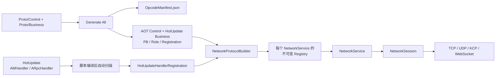

# MiniCore 网络与协议

本文描述重构后当前实现。全局程序集边界与启动流程见 [架构总览](Architecture.md)，快速规则见 [AI 项目上下文](AI_CONTEXT.md)。

## 1. 网络层组成

| 层级 | 路径 | 职责 |
| --- | --- | --- |
| 网络协议抽象 | `MiniCore.Network` | 消息角色接口、实例级 `NetworkProtocolBuilder` / `NetworkProtocolRegistry`、Handler 基类 |
| 序列化 | `MiniCore.Serialization` | `INetworkSerializer`、`ProtobufSerializer`、JSON 迁移/性能实现 |
| 固定控制面协议 | `MiniCore.Protocol.Control/Control.Inner` | Coordinator 查询、注册、心跳、状态与目录同步；AOT 固定携带 |
| 业务协议 | `MiniCore.Protocol.Common/Outer/Inner` | MiniBomber/NetworkLab 共享 DTO、客户端消息与服务间 RPC；HybridCLR 热更新 |
| 网络运行时 | `MiniCore.Network` | `NetworkService`、Session、RPC、心跳、TCP/UDP/KCP/WebSocket |
| 浏览器适配层 | `MiniCore.Platform.Browser` | WebGL JavaScript WebSocket 客户端适配器与 IndexedDB 存储注册；不改变网络业务 API |
| 业务层 | `MiniCore.HotUpdate.Client/Server` | 客户端 Handler、按 Role 注册的服务端 Handler及两个直接注册表 |
| 编辑器生成 | `MiniCore.Editor` | Proto 生成、Handler 扫描、Opcode Manifest、构建校验 |



## 2. Proto 与生成流程

### 2.1 文件位置与标记

协议源码放在仓库根目录 `Proto/`。第一层用 `Control` 与 `Business` 区分固定控制面和可热更新业务协议，第二层使用 `Common`、`Outer`、`Inner` 表达通信与发布边界。同一个 RPC 的 Request/Response 必须放在同一文件。仅用于共享 DTO、配置或存档的消息可以不写网络角色注解：生成器仍生成消息类，但不会为其生成网络角色、Parser 或 Opcode 注册项。

- `Control/Common|Outer`：服务类型、服务地址和 Client ↔ Coordinator 查询，进入 AOT Control；
- `Control/Inner`：注册、心跳、状态和目录同步，只进入 DS 的 AOT Control.Inner；
- `Business/Common`：业务两侧共同引用的 DTO/存档；
- `Business/Outer`：客户端可见的 MiniBomber/NetworkLab 消息；
- `Business/Inner`：Match、Database 等服务间 RPC，客户端程序集不可见。

```proto
syntax = "proto3";

package game.battle;
option csharp_namespace = "MiniCore.Protocol.Generated";

//[IRpcRequest]
message EnterBattleRequest {
  int64 role_id = 1;
}

//[IRpcResponse]
message EnterBattleResponse {
  int32 code = 1;
  string msg = 2;
  int64 battle_id = 3;
}
```

| 标记 | 生成的接口 | 含义 |
| --- | --- | --- |
| `//[INormalMessage]` | `INormalMessage` | 单向普通消息 |
| `//[IRpcRequest]` | `IRpcRequest` | 需要框架级响应匹配的请求 |
| `//[IRpcResponse]` | `IRpcResponse` | RPC 响应；必须有 `code` 与 `msg` 固定字段 |

`RpcId` 不是 Proto 字段。它在网络包头中传输，反序列化后写入生成 partial 的运行时属性；因此不会污染跨语言的 Protobuf Body。

### 2.2 执行生成

修改 Proto 后在 Unity 执行：

```text
MiniCore > Protocol > Generate All
```

此命令自动选择 `Proto/Tools/protoc-29.5` 中与当前平台匹配的官方 protoc，版本锁定为 `29.5`。它生成：

| 输出 | 路径 | 用途 |
| --- | --- | --- |
| 固定控制面 PB、角色与注册代码 | `Protocol/Control/Generated/Common|Outer|Inner` | Common/Outer 归属 AOT Control，Inner 归属 AOT Control.Inner |
| 项目业务 PB、角色与注册代码 | `Protocol/Generated/Common|Outer|Inner` | 分别归属于三个按运行侧裁剪的 HybridCLR 业务协议程序集 |
| 框架客户端设置 PB | `Assets/Scripts/MiniCore/Unity/Service/Persistence/Generated` | 固定归属 `MiniCore.Unity`，不受项目输出目录影响 |
| 稳定 Opcode 清单 | `Proto/Manifest/OpcodeManifest.json` | 网络角色消息的稳定类型到编号映射；删除项保留 |

项目只配置 Business 生成根目录；Control 固定输出到 AOT 目录。生成器校验五个目标程序集边界，Control 与 Business 共用 `OpcodeManifest.json`。`Proto/Internal` 是框架本地数据，`Proto/Tools` 是 import/protoc 工具，两者不进入网络协议扫描。所有 Control/Business Proto 文件名必须全局唯一；工具用归属清单清理旧生成文件，不递归清空开发者目录。

### 2.3 协议演进规则

- Control 协议变化必须重新构建并发布客户端或 DS Player，不作为日常热更新入口。
- Business 协议只允许追加字段、消息和枚举值；删除字段必须在 Proto 中声明 `reserved`。
- 禁止修改已有字段编号、复用历史 Opcode，或把已有消息从普通消息改成 RPC（反之亦然）。
- 破坏性语义变化创建新消息和新 Opcode，并用独立业务协议版本拒绝不兼容客户端；不长期保留旧实现。
- Database RPC 先以兼容字段发布并重启 DBServer，再发布 DS 的 Business Inner/HotUpdate Server；稳定后才能移除临时兼容处理。

## 3. Proto 驱动 Opcode，Handler 第二阶段绑定

### 3.1 消息与处理器分别负责什么

带网络角色注解的 Proto 消息是协议事实来源。生成时立即得到稳定 Opcode、角色和 Parser，因此合法的出站通知或暂时没有入站 Handler 的消息也能发送。普通 PB DTO 与存档 PB 没有网络角色，不进入网络 Registry。

```csharp
public sealed class EnterBattleHandler
    : ARpcHandler<EnterBattleRequest, EnterBattleResponse>
{
    public override MTask HandleAsync(
        NetworkSession session,
        EnterBattleRequest request,
        EnterBattleResponse response)
    {
        response.Code = 0;
        response.Msg = string.Empty;
        return MTask.CompletedTask;
    }
}
```

- `AMHandler<TMessage>` 只把普通消息绑定到处理逻辑，不分配 Opcode。
- `ARpcHandler<TRequest, TResponse>` 只绑定请求与响应处理关系；两种消息的 Opcode、角色和 Parser 已由 Proto 生成代码提供。
- 无 Handler 的网络消息可以合法出站；收到需要业务处理但没有 Handler 的消息会作为明确协议错误处理。
- 一个 Request/普通消息只能有一个 Handler；重复绑定会在自动生成/构建校验阶段失败。

### 3.2 自动同步时机

无需 Opcode 菜单。HotUpdate C# 源码变更并完成脚本编译后，生成器扫描已登记的 Shared、Client、Server 程序集：

1. `OpcodeHandlerRegistryInvalidator` 先将旧的直接 Handler 注册表变为安全空表，避免删除/改名 Handler 时旧 `new Handler()` 引用阻断首轮编译。
2. 独立 Proto Editor 程序集先生成 PB、角色、Opcode 和空 Handler stub；即使 HotUpdate 暂时编译失败，生成入口仍可使用。
3. 域重载后 `OpcodeAutoGenerator` 扫描全部已登记且已编译的热更新程序集，只更新 Handler 直接注册代码。
4. 若生成文件发生改变，Unity 再编译一轮；最终运行时注册表使用直接构造，无反射扫描。

生成物与约束：

| 文件 | 规则 |
| --- | --- |
| `Proto/Manifest/OpcodeManifest.json` | 稳定号码唯一事实来源；删除项永久保留，禁止手改/复用 |
| 项目输出目录中的 `*.ProtocolRegistration.g.cs` | 每个 Proto 的消息、Opcode、角色和 Parser 无状态注册入口 |
| `Outer/BusinessClientProtocolRegistration.g.cs` | 业务 Common + Outer 统一入口，客户端和 DS 均可调用 |
| `Inner/BusinessServerProtocolRegistration.g.cs` | 业务 Inner 统一入口，仅 DS 调用 |
| `HotUpdate/Generated/Network/HotUpdateHandlerRegistration.Generated.cs` | 只直接 `new` 客户端 Handler |
| `HotUpdate/Server/Generated/Network/ServerHotUpdateHandlerRegistration.Generated.cs` | 按 `DedicatedServerRole` 直接 `new` 服务端 Handler |

普通消息从 `100001` 起，RPC 从 `200001` 起。编号稳定性来自 Manifest，而不是类型排序。

## 4. 网络包与编解码

网络业务包固定为 12 字节头加 Protobuf Body：

```text
0               4               12
+---------------+---------------+--------------------+
| opcode uint32 | rpcId int64   | protobuf payload   |
| big-endian    | big-endian    | variable length    |
+---------------+---------------+--------------------+
```

| 字段 | 说明 |
| --- | --- |
| `opcode` | 从当前 `NetworkService` 的不可变 Registry 按消息 `Type` 查询，不保存在消息对象中 |
| `rpcId` | 普通消息为 `0`；RPC 请求与响应用于关联 pending RPC |
| `payload` | `ProtobufSerializer` 产生的 Protobuf 字节；包头字段不重复写入 Body |

传输层承载规则：

| Transport | 业务包承载方式 |
| --- | --- |
| TCP | `length int32 big-endian + packet`，由 `LengthPrefixedTcpTransportBase` 的连续接收缓冲处理粘包/半包；一次 Socket 接收可解析多个完整帧。 |
| UDP | `SendAsync`、RPC、心跳为一个 datagram 对应一个业务 packet；`TrySend` 高频普通数据在已有多个待发包时可使用 `MCUB` 批量 datagram，接收端拆回原业务 packet。 |
| KCP | UDP 承载 KCP 分片，KCP 重组后向上交付完整业务 packet |
| WebSocket | 二进制消息承载 `length int32 big-endian + packet`；接收端按字节流累计拆帧，不依赖一次回调恰好对应一个业务包 |

`NetworkService` 使用当前实例持有的不可变 Registry 查询 Type、Opcode、Parser 和 Handler，使用预分配固定容量入站环形队列接收数据，并在主线程 Tick 中完成反序列化和业务 Handler 派发。原生环境的网络执行器不调用 Unity API，也不直接执行业务 Handler；浏览器 WebGL 的 JavaScript 回调和 Handler 都运行在主循环，但仍经过同一固定容量队列与帧预算。

每条长连接只有一个接收循环，Ping、Pong、RPC 和普通可靠消息共用该 Session 的串行发送入口。Unity `NetworkService` 与独立 .NET `MiniCoreRpcClient` 默认每 `2` 秒发送一次 Ping，连续 `10` 秒没有 Pong 才判定连接失效；断线时一次性失败该 Session 的全部 Pending RPC，已经超时后才到达的响应按 RpcId 直接忽略。

单次 RPC 使用简单的末尾可选秒数，不要求业务构造 Options：

```csharp
await network.CallAsync<Request, Response>(sessionId, request); // 默认 10 秒
await network.CallAsync<Request, Response>(sessionId, request, timeoutSeconds: 3);
```

`timeoutSeconds` 必须大于零。RPC 超时只结束该请求，不主动断开仍健康的 Session；写请求超时表示结果未知，业务不得无条件重发。Ping 间隔、Pong 失效时间、Coordinator 五秒租约心跳和断线重连退避是四个独立概念，不作为 `CallAsync` 参数混在一起。

TCP 不按“每包读一次包头、再读一次正文”发起两次异步接收。传输保持一个初始 `64 KiB` 的连续接收缓冲，每次 `Socket.ReceiveAsync` 后从头解析所有可用完整帧；只有一个大帧跨越当前容量时才扩容到该帧所需容量。每个完整业务正文仍复制进独立租用数组，直到 `OnDataReceived` 全部回调完成后归还，因此不会把可重用的连续缓冲暴露给异步订阅者。该设计既保留 TCP 半包/粘包语义，又避免小包高频场景的每包双 I/O 等待。

UDP 的 `TrySend` 数据队列可将已经入队的多个小业务包编码为 `MCUB` v1 datagram：最多 `16` 个业务包、总 datagram 不超过 `1200 B`。发送器不会为了凑满批次等待；当只有一个包或包过大时仍发送原始单包。可靠/控制语义不参与该机制：`SendAsync`、RPC、心跳始终单包并等待写入完成。接收端仅在整个批量格式与每个长度均通过校验后才按原顺序拆包交付；批量 datagram 的 UDP 丢失会丢失其中全部易失性状态消息。`MCUB` 为传输层协议扩展，批量通信要求客户端与服务端同步升级。

WebSocket 客户端与监听器都沿用相同的 4 字节长度帧和 12 字节业务头。原生客户端适配器与监听器使用仓库固定版本的 `websocket-sharp`；普通浏览器 WebGL 由 `MiniCore.Platform.Browser` 注册 JavaScript 客户端适配器。这里的“适配器”是底层实现，不代表业务服务端。per-message 压缩关闭，并校验 WS/WSS URL、服务路径、二进制消息类型、最大消息大小、握手和关闭状态。WebSocket 可以直连游戏节点，也可以穿过不理解 Opcode 的透明网关；完整平台和网关边界见 [WebGL 与小游戏平台适配](WebPlatformAdaptation.md)。

### 执行器与退出

`NetworkService` 在启动时向 MTask 请求并持有自己的 I/O 执行器租约；线程创建、登记、调度、诊断和退出兜底仍由 MTask 统一管理。网络负责在自身释放时归还租约，并把该执行器注入监听器和 Transport。`CreateSingleThread` 每次创建一条顺序工作线程，不是全局“网络线程”单例。

有线程环境下，收发、协议拆包和线程安全数据阶段运行在该独占执行器，业务 Handler 回到 Unity 主线程队列；短时无亲和性计算可使用共享 `MTaskExecutors.ThreadPool`。浏览器 WebGL 无法取得线程租约时，网络自动使用 Unity 主循环执行器。业务 API 与队列模型不变，显式请求线程则清晰失败。

运行期释放网络组件时，`NetworkSessionComponent.OnDisposing()` 会先关闭监听器、Socket 和会话，解除阻塞 I/O；随后任务域取消，`OnDispose()` 才进行最终回收并正常等待网络线程退出。应用退出或停止 Play Mode 属于快速退出：只发出取消和执行器停止信号，不在 Unity 主线程 Join 网络线程，也不保证未完成收发或 finally 全部完成。

### 能力与执行边界

原生环境的 Unity 主线程负责最终 Handler、游戏状态和轻量封包；网络 I/O 执行器负责收包、拆包与线程安全协议阶段；每个会话唯一的出站发送泵在 MTask 共享线程池中串行等待底层异步写入，避免与收包/KCP 更新共用单线程产生争用。同一会话任意时刻仍仅有一个泵处理一个包，不改变会话内顺序。浏览器没有线程池，发送泵自动使用 Unity 主循环。

浏览器主线程入站派发使用双重预算，默认每帧最多 `256` 包或 `2 ms`，任一条件到达即把余量留到下一帧。固定容量队列、单会话预算、拒绝计数和持续拥塞断线机制确保无法处理的输入不会无限增长；竞技游戏应结合真机帧率和 Handler 成本调整预算，而不是取消上限。

监听规模增大后，可按会话稳定分配到有限数量的 I/O 分片，由所属分片负责该会话收包和有序写出；不要把所有会话串到一条全局发送线程。大型快照、压缩或昂贵序列化只能在主线程生成不可变快照后交给后台工作池，并在会话内按顺序提交发送；是否引入以多会话压测证明线程池或编码成为瓶颈为前提。

## 5. 调用方式

### 客户端连接与发送

`NetworkService` 是业务网络入口。启动生成代码先建立临时 `NetworkProtocolBuilder`，依次调用项目协议注册和 `HotUpdateHandlerRegistration`，完整校验后一次性提交不可变 Registry；连接、监听和收发在提交前都会拒绝执行。业务侧通过接口获取：

```csharp
INetworkService network = Global.GetService<INetworkService>(this);

bool connected = await network.ConnectDefaultTcpSessionAsync("127.0.0.1", 20000);
if (!connected)
{
    return;
}

await network.SendAsync(new SomeNormalMessage());
EnterBattleResponse response = await network.CallAsync<EnterBattleRequest, EnterBattleResponse>(
    new EnterBattleRequest { RoleId = 10001 });
```

普通浏览器 WebGL 使用同一接口连接 WSS：

```csharp
if (NetworkCapabilities.SupportsConnect(NetworkTransportKind.WebSocket))
{
    bool connected = await network.ConnectDefaultWebSocketSessionAsync(
        "wss://game.example.com/session");
}
```

发包前必须存在对应 Proto 网络角色和生成的 Opcode；不要在消息类或业务代码中硬编码 Opcode。

### 监听与上游连接

同一个 `INetworkService` 可以监听玩家连接，同时主动连接其他服务。例如某个无渲染 Player 可以启动 KCP 监听器，再建立 TCP 或 WebSocket 上游会话：

```text
Global.RegisterAppService<INetworkService, NetworkService>()
    -> CoordinatorOuterProtocolRegistration.Register(builder)
    -> BusinessClientProtocolRegistration.Register(builder)
    -> HotUpdateHandlerRegistration.Register(builder)
    -> network.ConfigureProtocol(builder.Build())
    -> Global.Pin<TimerService>()
    -> network.StartKcpServerAsync("0.0.0.0", port)
```

端口和运行流程由项目业务决定。框架不按 Client/Server 拆接口，也不把 Dedicated Server 建模为特殊网络层。调用前用 `NetworkCapabilities.SupportsListen` / `SupportsConnect` 查询当前环境；普通浏览器 WebGL 只允许 WS/WSS 主动连接。

## 6. 验证清单

修改网络相关代码后检查：

1. Proto 修改后已执行 `Generate All`，生成文件未缺失。
2. Unity 已完成脚本编译与 Opcode 自动同步，Console 无 C# 错误。
3. 新网络消息已有生成注册项；需要入站处理的消息有对应 Handler；删除消息后没有手动复用旧 Opcode。
4. RPC Response 保留 `Code`、`Msg` 字段，且 `RpcId` 没有加入 Proto Body。
5. Protobuf、完整入站包、RPC 相关性能测试仍可从 `Assets/Tests/Editor` 执行。
6. 构建前校验通过；HotUpdate DLL 与所需 AOT 元数据均已进入 YooAsset 包。
7. WebGL 构建确认浏览器平台程序集、`.jslib`、原生插件排除和禁用 API 校验全部通过。

## 7. 高频发送与固定容量队列

正式收包路径使用预分配数组、`lock` 保护的固定环形队列，而不是运行期可扩容的并发容器：普通队列全局上限为 `4096` 包或 `4 MiB`，单会话上限为 `1024` 包或 `1 MiB`；Ping/Pong 与带 `RpcId` 的包使用独立的 `256` 包 / `64 KiB` 控制保留容量。拒绝时不复制也不租用缓冲；快照会分别记录控制与普通队列拒绝数；同一会话持续满载三秒会被断开，重连策略由业务决定。

每个 `NetworkSession` 还有唯一的出站发送器。业务侧 `SendAsync`、客户端 `CallAsync` 和心跳进入可靠保留队列并等待底层写入；高频状态同步调用 `TrySend`，它只尝试进入数据队列并返回 `Accepted`、`QueueFull`、`Disconnected` 或 `SessionNotFound`，不等待 socket。服务端处理 RPC 请求时，响应仅在成功进入可靠保留队列后就释放主线程入站循环，不等待底层写入；队满或断线会记录错误并关闭该会话，绝不静默丢弃。Protobuf 直接写入发送器拥有的租用数组，发送、拒绝、异常和断线清理都会归还数组。`NetworkSession.GetOutboundQueueSnapshot()` 提供两条队列的当前包数、字节数与累计拒绝数，供压测执行器依据可靠队列余量进行背压调度；它不暴露或转移待发送缓冲区。

压测诊断可通过 `NetworkIncomingQueueSnapshot` 读取入站交接的平均值、最大值及固定时间桶 P50/P95/P99：网络线程入队到主线程开始处理，以及主线程单包 `HandleIncoming` 处理完成。该采样只在压测显式开启时写入预分配桶，不参与协议、队列容量、收发线程或业务 Handler 调度；它用于把端到端尾延迟定位到下一条可验证的边界，而不是改变运行时行为。
